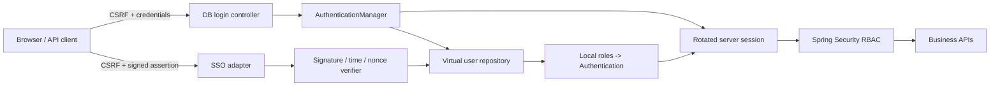

# Architecture

## 목표

서로 다른 인증 수단을 Spring Security의 하나의 `Authentication`과 서버 세션으로 변환하되, 외부 SSO assertion이 애플리케이션 권한을 직접 정하지 못하게 합니다.



## 구성요소

### 인증 입력

- DB 로그인은 `username`과 `password`를 `AuthenticationManager`에 전달합니다.
- SSO 로그인은 `issuer`, `audience`, `keyId`, `subject`, `issuedAtEpochSeconds`, `nonce`, `signature`만 받습니다.
- SSO 요청에는 역할 필드가 없습니다. 역할은 항상 로컬 사용자 저장소에서 조회합니다.

### SSO assertion 검증

서명 대상은 아래 canonical text입니다.

```text
issuer + "\n"
+ audience + "\n"
+ keyId + "\n"
+ subject + "\n"
+ issuedAtEpochSeconds + "\n"
+ nonce
```

검증 순서는 입력 형식, 설정된 issuer·audience·active keyId 일치, 발급 시각, HMAC-SHA256 서명, nonce 재사용 여부입니다. 기본 허용 범위는 과거 2분과 미래 10초이며 양 끝값은 포함합니다. 유효한 서명도 같은 nonce로 두 번째 요청하면 거부합니다.

issuer와 audience는 같은 secret을 잘못 공유한 다른 IdP·서비스 assertion의 재사용을 막는 별도 경계입니다. 각 relying party는 고유한 secret을 사용해야 합니다. 이 최소 adapter는 active key 하나만 지원하므로, 실제 key rotation에서는 이전·신규 key를 제한 시간 동안 함께 검증하는 key ring과 폐기 절차가 필요합니다.

### 권한 결정

SSO가 증명하는 것은 외부 subject뿐입니다. `sso-analyst-001` 같은 subject를 로컬 사용자에 연결한 뒤 해당 사용자의 `ROLE_*`만 `Authentication`에 넣습니다. 이 경계는 외부 assertion 조작이 관리자 권한 상승으로 이어지는 것을 막습니다.

### 세션과 CSRF

- 인증 전에 존재한 세션 ID는 인증 성공 시 교체합니다.
- Spring Security context는 서버 세션에 명시적으로 저장합니다.
- CSRF token 원본은 서버 세션에 저장하고 브라우저가 읽을 `XSRF-TOKEN` cookie도 함께 발급합니다.
- 로그인 자체를 포함한 모든 `POST` 요청은 응답의 header token, cookie와 같은 세션이 필요합니다.
- 인증 성공 시 기존 CSRF token과 cookie를 폐기하며, 이후 쓰기 전 `/auth/csrf`에서 새 token을 받아야 합니다.
- `/auth/logout`은 익명 멱등 endpoint가 아니라 인증된 세션과 CSRF가 모두 필요한 controller입니다.
- 세션이 없으면 `401`, 역할이 부족하거나 CSRF가 잘못되면 `403` JSON 응답을 반환합니다.

## 실패 정책

| 조건 | HTTP | 코드 | 의도 |
|---|---:|---|---|
| 비밀번호 오류, 미등록·비활성 SSO 사용자 | `401` | `AUTHENTICATION_FAILED` | 계정 존재 여부를 노출하지 않음 |
| 잘못된 서명, 만료, 미래 발급, nonce 재사용 | `401` | `AUTHENTICATION_FAILED` | assertion을 신뢰하지 않음 |
| issuer, audience 또는 keyId 불일치 | `401` | `AUTHENTICATION_FAILED` | 다른 서비스·환경·key assertion 재사용 차단 |
| SSO 공유 비밀 미설정·너무 짧음 | `503` | `SSO_ADAPTER_UNAVAILABLE` | 취약한 기본값으로 우회하지 않음 |
| 세션 없음 | `401` | `UNAUTHENTICATED` | redirect 대신 API 계약 유지 |
| CSRF 누락·오류 | `403` | `INVALID_CSRF` | 상태 변경 차단 |
| 역할 부족 | `403` | `ACCESS_DENIED` | 인증과 인가 실패를 분리 |

## 교체 가능한 경계

- `VirtualUserRepository`: in-memory에서 JPA/MyBatis/LDAP adapter로 교체
- `SsoAssertionVerifier`: HMAC 샘플에서 OIDC token validator 또는 SAML adapter로 교체
- `ReplayNonceStore`: 단일 JVM map에서 Redis 원자 연산으로 교체
- `SessionCookieCsrfTokenRepository`: 단일 세션 저장에서 분산 세션 정책에 맞는 저장소로 교체
- `SecurityContextRepository`: 서버 세션 clustering 정책에 맞게 교체

로그인 rate limit, 계정 lockout과 인증·인가 감사 이벤트는 이 최소 샘플에 포함하지 않았습니다. 운영 전에는 민감한 입력을 남기지 않는 구조화 감사 이벤트와 계정·IP 단위 제한 정책을 별도 구성요소로 추가해야 합니다.

핵심 애플리케이션 권한과 API 계약은 adapter 교체 후에도 유지됩니다.
