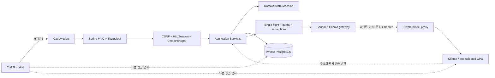

# OpsMate Local Architecture

## 설계 목표

OpsMate Local은 모델의 유연한 제안과 업무 시스템의 결정적 통제를 분리합니다.

1. 모델 출력은 제안이며 트랜잭션 명령이 아닙니다.
2. 모델은 정책 조회 포트, DB, 저장소 또는 임의 네트워크 도구의 실행 권한을 받지 않습니다.
3. 모든 쓰기는 서버가 부여한 workspace·actor, RBAC, 도메인 상태 전이와 트랜잭션을 통과합니다.
4. 모델 장애·잘못된 JSON·근거 불일치·과대 응답에서는 해당 초안 생성을 저장하지 않습니다. 이미 제출된 요청의 승인·반려·발주는 모델 호출과 분리합니다.
5. 공개 방문자의 합성 데이터와 제한된 GPU 자원을 애플리케이션이 명시적으로 격리·제한합니다.
6. 서비스는 수동으로 연 기간에만 실행하며, 검증 뒤 양쪽 호스트를 닫고 같은 artifact로 다시 열 수 있어야 합니다.

## 실행 구조와 신뢰 경계

로컬 개발·회귀 테스트에서는 H2와 stateless Basic REST API를 사용할 수 있습니다. 공개 `demo` 프로필은 PostgreSQL, Thymeleaf와 session 보안 체인을 사용하고 `/api/**`를 모두 거부합니다.

## 공개 웹과 로컬 API 분리

Spring Security는 두 경로를 분리합니다.

- 공개 웹: 서버가 생성한 `DemoPrincipal`, HttpSession, CSRF, 동일 출처 form
- 로컬 API: 환경변수 비밀번호를 사용하는 stateless Basic 인증
- 공개 `demo` 프로필: Basic 비활성, `/api/**` `denyAll`, Basic challenge 없음

첫 화면의 CSRF cookie 생성은 서버 session을 만들지 않습니다. `POST /demo/sessions`가 admission 검사를 통과한 뒤에만 session과 workspace를 생성합니다. 수용량 또는 시작률 제한으로 거부된 익명 요청은 불필요한 server session을 남기지 않습니다.

세션 cookie는 공개 프로필에서 `Secure`, `HttpOnly`, `SameSite=Lax`로 설정합니다. 애플리케이션은 CSP·frame 차단·상세 오류 숨김과 16KB header/form 제한을 적용하고, edge는 frame 등 보안 header와 16KB request body 제한을 적용합니다. 이 속성의 실제 HTTPS 응답 확인은 외부 공개 smoke gate에 남아 있습니다.

## DemoPrincipal과 workspace 격리

`POST /demo/sessions`가 추측하기 어려운 workspace UUID, 만료 시각과 활성 상태를 PostgreSQL에 저장하고 세션에 최초 `REQUESTER` persona를 둡니다. 브라우저가 보낸 workspace나 actor 문자열은 권한 판단에 사용하지 않습니다.

모든 요청·발주·감사 entity에는 `workspace_id`가 있고 repository query도 workspace를 필수 조건으로 사용합니다. 서비스 계층은 조회 결과의 workspace를 다시 확인한 뒤 역할, 소유권과 상태를 검사합니다. 목록은 정렬과 최대 100건 상한을 서버가 고정합니다.

workspace는 다음 경로로 삭제됩니다.

- TTL 만료 후 scheduled cleanup
- 사용자의 `/demo/reset` 또는 `/demo/end`
- 정상 service close의 전체 합성 workspace purge

workspace 삭제 시 요청·발주·감사 이벤트는 DB cascade로 함께 삭제됩니다. 시작·reset에는 전체 고정 시간창 admission limit이 있고, active workspace 최대치 확인과 생성은 단일 애플리케이션 인스턴스 안에서 직렬화합니다.

## 서버 주도 정책 조회 포트

`PolicyEvidenceTool.search(PolicySearchQuery)`는 모델 tool-calling이 아니라 `PurchaseDraftAgent`가 서버 코드에서 먼저 호출하는 타입 고정 포트입니다.

- 포트 식별자: `policy.search`
- 입력: 자연어 질의
- 출력: `PolicyEvidence` 목록
- 데이터 원천: 코드에 포함된 합성 정책 카탈로그
- URL, SQL, 파일 경로 또는 클래스명을 실행 인자로 받는 API 없음

서버가 근거를 찾지 못하면 모델을 호출하지 않습니다. 모델이 반환한 `policyIds`는 조회 결과의 부분집합인지 서버가 다시 검증합니다.

## 모델 gateway와 호출 보호

`LocalOpenWeightLlmGateway`는 애플리케이션 계층 포트입니다.

- 기본은 비활성 gateway이며 `MODEL_UNAVAILABLE`로 실패합니다.
- `opsmate.llm.enabled=true`에서만 Ollama 호환 adapter를 활성화합니다.
- base URL scheme·host allowlist·고정 `/api/chat` 경로를 시작 시 검증합니다.
- Bearer token, connect/read timeout, 출력 토큰 상한과 응답 바이트 상한을 적용합니다.
- HTTP 본문은 바이트 상한까지만 읽고 JSON을 역직렬화합니다.
- timeout·HTTP 오류·빈 응답·과대 응답·잘못된 JSON은 저장 전 모델 실패로 정규화합니다.
- 다른 모델이나 유료 API fallback은 없습니다.

`DraftGenerationCoordinator`는 모델 호출 앞에서 다음 경계를 적용합니다.

1. `(workspaceId, actor, idempotencyKey)`가 같은 최초 요청을 single-flight로 합칩니다.
2. 같은 flight를 기다릴 수 있는 follower 수와 대기 시간을 제한합니다.
3. workspace별 호출량과 workspace 삭제로 초기화되지 않는 전체 호출량을 고정 시간창으로 제한합니다.
4. fair semaphore로 전체 동시 모델 호출 수를 제한하며 공개 기본값은 `1`입니다.
5. queue 대기 시간을 넘기면 해당 초안을 만들지 않고 busy 오류로 종료합니다.

이 조정 상태는 메모리에 있으므로 공개 데모는 애플리케이션 한 인스턴스를 전제로 합니다. 다중 인스턴스에서는 PostgreSQL 또는 외부 조정 저장소로 이전해야 합니다. 인터넷 edge의 익명 요청 rate limit과 호스트 egress 목적지 allowlist는 애플리케이션 코드만으로 증명할 수 없어 외부 배포 gate로 둡니다.

## 역할과 상태 전이

역할은 endpoint와 service method에서 이중으로 확인합니다.

| 행위 | REQUESTER | APPROVER | BUYER | AUDITOR |
|---|---:|---:|---:|---:|
| 초안 생성 | O | X | X | X |
| 자신의 초안 제출 | O | X | X | X |
| 승인·반려 | X | O | X | X |
| 발주 생성 | X | X | O | X |
| 현재 workspace 감사 조회 | X | X | X | O |

승인자는 역할을 가지고 있어도 자신이 만든 요청을 승인할 수 없습니다. persona 전환은 한 방문자가 전체 흐름을 체험하기 위한 기능이며 실제 조직 IAM이나 직무 분리를 증명하지 않습니다.

| 현재 상태 | 명령 | 다음 상태 | 추가 조건 |
|---|---|---|---|
| 없음 | 초안 생성 | DRAFT | 정책 근거와 유효한 모델 출력 |
| DRAFT | 제출 | PENDING_APPROVAL | 요청자 본인 |
| PENDING_APPROVAL | 승인 | APPROVED | APPROVER, 자기 승인 금지 |
| PENDING_APPROVAL | 반려 | REJECTED | APPROVER, 반려 사유 필수 |
| APPROVED | 발주 | ORDERED | BUYER, 발주 미존재 |

나머지 전이는 `INVALID_STATE`로 거부합니다.

## 멱등성, 중복과 트랜잭션

애플리케이션 멱등성은 workspace·행위자·key와 입력 fingerprint를 비교합니다. 같은 key와 같은 입력의 재시도는 기존 결과를 반환하고, 다른 입력은 `409 Conflict`로 거부합니다.

DB는 다음 불변식을 최종 강제합니다.

- 초안: `(workspace_id, requested_by, idempotency_key)` 고유 제약
- 발주: `(workspace_id, created_by, idempotency_key)` 고유 제약
- 구매 요청당 발주 최대 한 건
- 발주와 요청의 workspace 일치
- JPA `@Version` optimistic lock

초안 저장과 `DRAFT_CREATED`, 상태 전이와 대응 감사 이벤트, 발주 저장·`ORDERED` 전이·`ORDER_CREATED`는 각각 같은 트랜잭션입니다. 발주 후처리가 실패하면 발주·상태·성공 감사 이벤트를 모두 롤백합니다.

## PostgreSQL migration과 권한

공개 프로필은 PostgreSQL과 `ddl-auto=validate`를 사용합니다. 역할은 세 가지로 분리합니다.

| 역할 | 수명과 권한 |
|---|---|
| admin | 최초 DB·역할 준비와 정상 close의 합성 데이터 purge |
| migration | one-shot Flyway 실행과 schema 소유 |
| runtime | 장기 실행 앱의 필요한 DML·sequence 권한만 보유 |

`migrate` 컨테이너가 `--opsmate-migrate-only` 명령으로 migration을 마친 뒤에만 앱을 시작합니다. 장기 실행 앱 환경에는 migration credential을 주지 않습니다. after-migrate callback은 runtime 역할의 Flyway history 접근을 회수합니다. Testcontainers 검증 경로는 runtime DML 허용, 임의 DDL과 Flyway history 조회 거부, DB cascade를 확인하도록 구성했습니다.

## 컨테이너와 네트워크

애플리케이션 호스트는 `db`, one-shot `migrate`, `app`, `caddy`로 나뉩니다.

- public port는 Caddy의 80/443뿐입니다.
- Caddy와 DB는 같은 네트워크를 공유하지 않습니다.
- `edge_to_app`와 `app_to_db`는 internal network입니다.
- 앱의 모델 outbound는 별도 `model_egress` network를 사용합니다.
- 모든 서비스는 `restart: "no"`로 수동 open gate 없이 재기동하지 않습니다.
- PostgreSQL과 Caddy base image는 full digest로 고정합니다.
- 앱 reopen은 검증한 registry image의 full digest를 요구합니다.
- 앱·migration 컨테이너는 read-only root filesystem, tmpfs, `cap_drop: ALL`, `no-new-privileges`를 사용합니다.
- json-file log는 파일 크기와 개수를 제한하고 Caddy access log는 활성화하지 않습니다.

모델 호스트는 Ollama와 인증 proxy를 분리합니다. Ollama는 host port를 공개하지 않고 proxy만 승인된 VPN IPv4에 bind합니다. proxy는 Bearer token과 `/api/chat`, `/api/tags` 경로만 허용하며 선택한 한 GPU만 컨테이너에 전달합니다. Ollama image digest, 모델의 명시적 tag와 실제 content ID가 승인값과 일치해야 열립니다.

host firewall/egress policy가 모델 목적지만 허용한다는 증거와 public edge/WAF rate limit은 저장소 Compose만으로 강제할 수 없습니다. `open-demo.sh`는 두 증거 flag가 `YES`가 아니면 공개하지 않지만, 실제 정책 적용 여부는 배포 환경에서 별도 검수해야 합니다.

## 열기와 닫기의 실패 경계

- `open-demo.sh`는 환경·digest·DB 역할·private model endpoint·외부 정책 증거를 점검하고, DB→migration→app→Caddy 순서로 시작한 뒤 실제 모델을 포함한 HTTPS smoke를 실행합니다.
- 정상 앱 close는 Caddy→app 순서로 쓰기 주체를 멈추고 합성 workspace를 삭제한 뒤 DB를 중단합니다.
- 정상 모델 close는 VPN-bound proxy→Ollama 순서로 멈추고 port와 컨테이너 중단을 확인합니다.
- app close와 model close는 서로 다른 호스트의 별도 명령입니다. 둘 다 성공해야 전체 서비스가 닫힙니다.
- 환경 파일을 잃은 사고에서는 Compose label 기반 emergency close가 credential 없이 컨테이너를 중단합니다. 이 경로는 합성 데이터 purge를 하지 않으므로 환경 복구 후 정상 close가 필요합니다.
- DB와 model volume은 보존합니다. reopen은 같은 app digest와 승인 모델 ID를 사용하지만 과거 공개 session 데이터는 복원하지 않습니다.

실제 양 호스트에서의 close/reopen rehearsal은 아직 수행하지 않았습니다.

## 감사와 공개 범위

감사 이벤트에는 workspace, aggregate, actor, action과 비민감 metadata만 저장합니다. 자연어 원문, 전체 prompt, 비밀번호와 token은 넣지 않습니다. 애플리케이션 수준의 감사 이벤트이며 DB 관리자의 변경까지 막는 cryptographic ledger는 아닙니다.

모든 정책과 데이터는 독립적으로 만든 합성 예시입니다. 회사 코드, 고객 정보, 내부 주소와 접속 정보를 포함하지 않습니다.

## 현재 한계와 미검증 범위

- `2026-08-04` 전체 `clean verify`에서 54개 테스트가 성공했고 실패·오류·건너뜀은 0개였습니다.
- 승인된 실제 오픈웨이트 모델의 구조화 출력 품질·p95 지연·GPU 용량은 미검증입니다.
- 공개 도메인, ACME, host egress allowlist, edge/WAF rate limit과 외부 모바일 smoke는 미검증입니다.
- 실제 앱·모델 호스트의 정상 close, emergency close와 same-digest reopen rehearsal은 미검증입니다.
- in-memory single-flight·quota·semaphore는 단일 앱 인스턴스에만 유효합니다.
- 합성 정책 카탈로그는 실제 ERP 정책의 복잡성을 대표하지 않습니다.
- PostgreSQL Testcontainers 검증은 실제 장기 운영·성능·백업을 증명하지 않습니다.
- 외부 ERP, OIDC/SSO, 분산 락, outbox와 변조 불가능 감사 원장은 범위 밖입니다.
