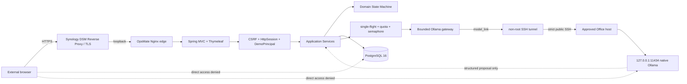

# OpsMate Local Architecture

## 설계 목표

OpsMate Local은 모델의 유연한 제안과 업무 시스템의 결정적 통제를 분리합니다.

1. 모델 출력은 제안이며 트랜잭션 명령이 아닙니다.
2. 모델은 정책 조회 포트, DB, 저장소 또는 임의 네트워크 도구의 실행 권한을 받지 않습니다.
3. 모든 쓰기는 서버가 부여한 workspace·actor, RBAC, 도메인 상태 전이와 트랜잭션을 통과합니다.
4. 모델 장애·잘못된 JSON·근거 불일치·과대 응답에서는 해당 초안 생성을 저장하지 않습니다.
5. 공개 방문자의 합성 데이터와 제한된 모델 자원을 애플리케이션이 명시적으로 격리·제한합니다.
6. 공개 서비스는 수동 open gate를 통과한 기간에만 실행하며 close/reopen을 검증 가능하게 유지합니다.

## 실행 구조와 신뢰 경계



로컬 개발·회귀 테스트에서는 H2와 stateless Basic REST API를 사용할 수 있습니다. 공개 `demo` 프로필은 PostgreSQL, Thymeleaf와 session 보안 체인을 사용하고 `/api/**`를 거부합니다.

## 공개 edge

Synology runtime에서 80/443은 DSM이 이미 사용하고 있습니다. OpsMate는 이 포트를 직접 점유하지 않습니다.

- DSM: public TLS termination과 external reverse proxy
- OpsMate Nginx: NAS `127.0.0.1:<high-port>`에만 bind
- Nginx: `/actuator/**` 차단, 16KB body 제한, security headers, live marker
- Nginx: 별도의 anonymous global request-rate limit과 `429`
- Spring app: host port 없음

DSM source hostname/HTTPS port와 router forwarding은 외부 배포 gate에서 실제 환경을 확인해 구성합니다.

## 공개 웹과 로컬 API 분리

Spring Security는 두 경로를 분리합니다.

- 공개 웹: 서버가 생성한 `DemoPrincipal`, HttpSession, CSRF, 동일 출처 form
- 로컬 API: 환경변수 비밀번호를 사용하는 stateless Basic 인증
- 공개 `demo` 프로필: Basic 비활성, `/api/**` `denyAll`, Basic challenge 없음

첫 화면의 CSRF cookie 생성은 서버 session을 만들지 않습니다. `POST /demo/sessions`가 admission 검사를 통과한 뒤에만 session과 workspace를 생성합니다.

세션 cookie는 공개 프로필에서 `Secure`, `HttpOnly`, `SameSite=Lax`로 설정합니다. 실제 HTTPS 속성은 public smoke에서 다시 확인합니다.

## DemoPrincipal과 workspace 격리

`POST /demo/sessions`가 추측하기 어려운 workspace UUID, 만료 시각과 활성 상태를 PostgreSQL에 저장하고 최초 `REQUESTER` persona를 부여합니다. 브라우저가 보낸 workspace나 actor 문자열은 권한 판단에 사용하지 않습니다.

모든 요청·발주·감사 entity에는 `workspace_id`가 있고 repository query도 workspace를 필수 조건으로 사용합니다. 서비스 계층은 조회 결과의 workspace를 방어적으로 다시 확인한 뒤 역할, 소유권과 상태를 검사합니다.

workspace는 다음 경로로 삭제됩니다.

- TTL 만료 후 scheduled cleanup
- 사용자의 `/demo/reset` 또는 `/demo/end`
- 정상 service close의 전체 합성 workspace purge

workspace 삭제 시 요청·발주·감사 이벤트는 DB cascade로 함께 삭제됩니다.

## 서버 주도 정책 조회 포트

`PolicyEvidenceTool.search(PolicySearchQuery)`는 모델 tool-calling이 아니라 `PurchaseDraftAgent`가 서버 코드에서 먼저 호출하는 타입 고정 포트입니다.

- 입력: 자연어 질의
- 출력: `PolicyEvidence` 목록
- 데이터 원천: 코드에 포함된 합성 정책 카탈로그
- URL, SQL, 파일 경로 또는 클래스명을 실행 인자로 받는 API 없음

서버가 근거를 찾지 못하면 모델을 호출하지 않습니다. 모델이 반환한 `policyIds`는 조회 결과의 부분집합인지 서버가 다시 검증합니다.

## 모델 gateway와 호출 보호

`LocalOpenWeightLlmGateway`는 애플리케이션 계층 포트입니다.

- 기본은 비활성 gateway이며 모델 의존 초안은 fail-closed합니다.
- `opsmate.llm.enabled=true`에서만 Ollama 호환 adapter를 활성화합니다.
- base URL scheme·host allowlist·고정 `/api/chat` 경로를 시작 시 검증합니다.
- connect/read timeout, 출력 토큰 상한과 응답 바이트 상한을 적용합니다.
- timeout·HTTP 오류·빈 응답·과대 응답·잘못된 JSON은 저장 전 모델 실패로 정규화합니다.
- 다른 모델이나 유료 API fallback은 없습니다.

공개 배포에서는 다음으로 고정합니다.

```text
OPSMATE_LLM_BASE_URL=http://model-tunnel:11434
OPSMATE_LLM_ALLOWED_HOSTS=model-tunnel
```

앱은 `model_link` internal network를 통해서만 tunnel에 접근합니다.

`DraftGenerationCoordinator`는 모델 호출 앞에서 다음 경계를 적용합니다.

1. `(workspaceId, actor, idempotencyKey)` 동일 요청 single-flight
2. follower 수와 결과 대기 시간 제한
3. workspace별·전체 호출 quota
4. fair semaphore 기반 전체 동시 모델 호출 `1`
5. bounded queue wait와 busy/rate 오류

이 조정 상태는 메모리에 있으므로 공개 데모는 애플리케이션 한 인스턴스를 전제로 합니다.

## restricted SSH model transport

Office에는 native Ollama가 있고 Docker가 없습니다. 따라서 Office에 별도 model-host container/proxy를 설치하지 않습니다.

Synology `model-tunnel` 컨테이너만 outbound network를 가지며 다음 SSH 조건을 사용합니다.

- dedicated NAS-local Ed25519 key
- `StrictHostKeyChecking=yes`
- exact Office host key
- public-key-only authentication
- Office `authorized_keys`: `restrict` + forwarding-only + `permitopen="127.0.0.1:11434"` + forced false command
- tunnel의 11434는 Docker `model_link`에만 노출되고 NAS host port로 publish하지 않음

이 경계는 OpsMate 전용 credential이 shell/remote-command credential로 사용되지 않으면서 Ollama loopback forwarding은 성공하는지 실제 E2E로 검증해야 합니다.

## 역할과 상태 전이

| 행위 | REQUESTER | APPROVER | BUYER | AUDITOR |
|---|---:|---:|---:|---:|
| 초안 생성 | O | X | X | X |
| 자신의 초안 제출 | O | X | X | X |
| 승인·반려 | X | O | X | X |
| 발주 생성 | X | X | O | X |
| 현재 workspace 감사 조회 | X | X | X | O |

승인자는 자신이 만든 요청을 승인할 수 없습니다. persona 전환은 공개 체험 기능이며 실제 조직 IAM이나 직무 분리를 증명하지 않습니다.

```text
DRAFT -> PENDING_APPROVAL -> APPROVED -> ORDERED
                          \-> REJECTED
```

나머지 전이는 `INVALID_STATE`로 거부합니다.

## 멱등성, 중복과 트랜잭션

애플리케이션 멱등성은 workspace·행위자·key와 입력 fingerprint를 비교합니다. 같은 key와 같은 입력의 재시도는 기존 결과를 반환하고 다른 입력은 `409 Conflict`로 거부합니다.

DB는 다음 불변식을 최종 강제합니다.

- 초안: `(workspace_id, requested_by, idempotency_key)` 고유 제약
- 발주: `(workspace_id, created_by, idempotency_key)` 고유 제약
- 구매 요청당 발주 최대 한 건
- 발주와 요청의 workspace 일치
- JPA `@Version` optimistic lock

초안 저장과 감사 이벤트, 상태 전이와 감사 이벤트, 발주 저장·`ORDERED` 전이·`ORDER_CREATED`는 각각 같은 트랜잭션 경계에 있습니다.

## PostgreSQL migration과 권한

공개 프로필은 PostgreSQL과 `ddl-auto=validate`를 사용합니다.

| 역할 | 수명과 권한 |
|---|---|
| admin | 최초 DB·역할 준비와 정상 close의 합성 데이터 purge |
| migration | one-shot Flyway 실행과 schema 소유 |
| runtime | 장기 실행 앱의 필요한 DML·sequence 권한만 보유 |

`migrate` 컨테이너가 `--opsmate-migrate-only`로 migration을 마친 뒤에만 앱을 시작합니다. 장기 실행 앱 환경에는 migration credential을 주지 않습니다. Testcontainers는 runtime DML 허용, 임의 DDL/Flyway history 조회 거부와 cascade를 검증합니다.

## 컨테이너와 네트워크

```text
edge_to_app   internal: edge <-> app
app_to_db     internal: app/migrate <-> PostgreSQL
model_link    internal: app <-> model-tunnel
tunnel_egress external: model-tunnel -> Office SSH
```

- `edge`만 NAS loopback host port 하나를 publish합니다.
- `db`, `app`, `model-tunnel`은 host port가 없습니다.
- app에는 `tunnel_egress`가 없습니다.
- 모든 long-running 서비스는 `restart: "no"`로 수동 open gate 없이 자동 공개되지 않습니다.
- app/tunnel runtime은 non-root, read-only root filesystem, `cap_drop: ALL`, `no-new-privileges`를 사용합니다.
- PostgreSQL/Nginx base image와 배포 app/tunnel image는 immutable reference를 사용합니다.

CI는 Compose의 실제 rendered JSON을 검사해 이 network/port 경계가 깨지면 실패합니다.

## 열기와 닫기의 실패 경계

`open-demo.sh` 순서:

```text
preflight
-> model-tunnel health
-> PostgreSQL
-> one-shot migration
-> app readiness
-> loopback Nginx edge
-> public HTTPS smoke
```

정상 close:

```text
edge
-> app graceful stop
-> model-tunnel
-> synthetic workspace purge
-> DB stop
-> closed verification
```

emergency close는 `.env` 없이 Compose label로 OpsMate project의 edge/app/model-tunnel/migrate/DB만 중단합니다. Office native Ollama와 다른 NAS workload는 건드리지 않습니다.

reopen은 같은 app/tunnel digest를 사용하고 tunnel health, migration/readiness와 public smoke를 다시 통과해야 같은 artifact의 재개로 인정합니다.

## 현재 검증 경계

- `2026-08-04`: 전체 `clean verify` 54개 성공
- `2026-08-23`: `gemma3:12b` 실제 모델 E2E 9/9, p95 21,076ms
- Synology Docker/x86_64와 DSM 80/443 점유: runtime probe 확인
- Office native Ollama/model: runtime probe 확인
- Compose/Nginx/tunnel 정적·CI 경계: PR CI에서 검증
- NAS -> restricted SSH tunnel -> Office Ollama: 실제 runtime E2E 미검증
- DSM public ingress, 외부 smoke, 외부 DB/model 차단: 미검증
- normal/emergency close + same-digest reopen: 미검증

미검증 항목을 실제 운영 완료로 표현하지 않습니다.
