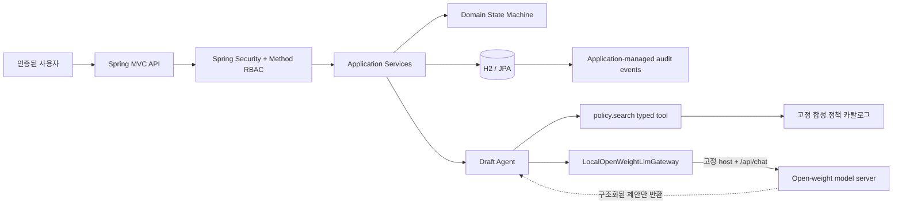

# OpsMate Local Architecture

## 설계 목표

OpsMate Local은 모델의 유연한 추론과 업무시스템의 결정적 통제를 분리합니다.

1. 모델 출력은 제안이며 트랜잭션 명령이 아니다.
2. 모델은 DB, 저장소, 네트워크 도구를 직접 받지 않는다.
3. 모든 쓰기는 인증된 사용자, 고정 API, 도메인 상태 전이와 트랜잭션을 통과한다.
4. 모델 장애·잘못된 JSON·근거 불일치에서는 아무 쓰기도 하지 않는다.
5. 발주는 애플리케이션 검사와 DB 고유 제약으로 요청당 최대 한 건이 되도록 설계한다.

## 구성요소와 신뢰 경계

LLM이 접하는 입력은 사용자의 자연어, 서버가 검색한 정책 근거와 출력 스키마뿐입니다. JPA repository, `RestClient`, 승인 서비스와 발주 서비스는 tool 목록에 포함되지 않습니다.

## 고정 typed tool

Agent가 사용할 수 있는 도구는 `PolicyEvidenceTool.search(PolicySearchQuery)` 하나입니다.

- 도구 이름: `policy.search`
- 입력: 자연어 질의
- 출력: `PolicyEvidence` 목록
- 데이터 원천: 코드에 포함된 합성 정책 카탈로그
- 금지: URL, SQL, 파일 경로 또는 클래스명을 입력으로 받는 범용 도구

정책을 찾지 못하면 모델을 호출하지 않고 실패합니다. 모델이 반환한 `policyIds`는 실제 검색 결과의 부분집합인지 다시 검증합니다.

## 로컬 모델 gateway

`LocalOpenWeightLlmGateway`는 애플리케이션 계층의 포트입니다.

- 기본 구현은 비활성 gateway이며 항상 `MODEL_UNAVAILABLE`을 반환합니다.
- `opsmate.llm.enabled=true`에서만 Ollama 호환 HTTP adapter가 활성화됩니다.
- base URL의 scheme과 host를 시작 시 검증합니다.
- 요청마다 URL이나 모델 provider를 바꿀 수 없습니다.
- 호출 경로는 `/api/chat`으로 고정됩니다.
- 타임아웃·HTTP 오류·빈 응답·잘못된 JSON은 모두 모델 실패로 정규화합니다.
- 외부 API fallback은 구현하지 않습니다.

모델 출력은 `DraftProposal`로 역직렬화한 다음 제목, 목적, 금액, 통화, 분류, 정책 ID를 검증합니다. 검증을 통과하기 전에는 JPA entity를 만들지 않습니다.

## 역할과 권한

역할은 endpoint와 service method에서 이중으로 확인합니다.

| 행위 | REQUESTER | APPROVER | BUYER | AUDITOR |
|---|---:|---:|---:|---:|
| 초안 생성 | O | X | X | X |
| 자신의 초안 제출 | O | X | X | X |
| 승인·반려 | X | O | X | X |
| 발주 생성 | X | X | O | X |
| 감사 이벤트 조회 | X | X | X | O |

승인자는 역할을 가지고 있어도 자신이 만든 요청을 승인할 수 없습니다.

### 요청 상세 객체 권한

| 역할 | 읽을 수 있는 요청 |
|---|---|
| REQUESTER | `requestedBy`가 자신인 요청의 모든 상태 |
| APPROVER | 결재 작업 대상인 `PENDING_APPROVAL` 요청 |
| BUYER | 발주 작업 대상인 `APPROVED`와 처리 완료된 `ORDERED` 요청 |
| AUDITOR | 감사 목적의 모든 요청 |

비감사 역할에는 존재하지 않는 UUID와 권한이 없는 UUID를 모두 `403`으로 마스킹합니다. AUDITOR만 전체 객체를 읽을 수 있으므로 존재하지 않는 UUID에서 `404`를 받습니다.

## 상태 전이

| 현재 상태 | 명령 | 다음 상태 | 추가 조건 |
|---|---|---|---|
| 없음 | 초안 생성 | DRAFT | 정책 근거와 유효한 모델 출력 |
| DRAFT | 제출 | PENDING_APPROVAL | 요청자 본인 |
| PENDING_APPROVAL | 승인 | APPROVED | APPROVER, 자기 승인 금지 |
| PENDING_APPROVAL | 반려 | REJECTED | APPROVER, 반려 사유 필수 |
| APPROVED | 발주 | ORDERED | BUYER, 발주 미존재 |

나머지 전이는 `OpsMateException`의 `INVALID_STATE` 코드로 거부합니다. 승인과 반려를 수행한 사용자는 의미를 일반화한 `decidedBy`에 기록합니다.

## 멱등성과 중복 발주 차단

두 겹으로 통제합니다.

1. 애플리케이션 멱등성
   - 초안: `(requested_by, idempotency_key)`로 기존 결과 조회
   - 발주: `(created_by, idempotency_key)`로 기존 결과 조회
   - 같은 키와 같은 fingerprint는 기존 결과 반환
   - 같은 키와 다른 fingerprint는 `409 Conflict`
2. 데이터베이스 불변식
   - 구매 요청당 발주 ID 고유 제약
   - 발주 idempotency key 고유 제약
   - JPA `@Version`으로 상태 변경 충돌 감지

사전 조회는 사용성을 위한 빠른 경로이며 DB 고유 제약과 JPA optimistic lock이 최종 충돌을 거부합니다. optimistic lock과 DB constraint 예외는 API에서 `WRITE_CONFLICT`와 HTTP `409`로 정규화합니다. stale JPA version 한 건은 결정적으로 검증하지만 동시성 부하·stress test를 수행한 것은 아닙니다.

초안 생성은 모델 호출 후 트랜잭션에서 idempotency key를 다시 검사합니다. 따라서 동일한 새 키가 동시에 들어오면 저장은 한 건으로 제한되지만 모델 호출은 중복될 수 있습니다. key별 in-flight single-flight 조정과 사용자별 rate limit은 이 최소 범위에 포함하지 않았습니다.

## 트랜잭션과 롤백

- 초안 저장과 `DRAFT_CREATED` 감사 이벤트는 한 트랜잭션입니다.
- 제출·승인·반려와 대응 감사 이벤트는 각각 한 트랜잭션입니다.
- 발주 저장, 요청의 `ORDERED` 전이와 `ORDER_CREATED` 감사 이벤트는 한 트랜잭션입니다.
- 발주 후처리가 예외를 던지면 발주·상태·성공 감사 이벤트가 모두 롤백됩니다.

실패 시도를 성공 이벤트로 기록하지 않습니다. 운영 환경에서 실패 감사를 별도 영속화하려면 outbox 또는 별도 보안 이벤트 스트림을 사용해야 하며, 이 최소 범위에는 포함하지 않았습니다.

## 데이터 모델

### PurchaseRequest

- 식별자, 버전
- 요청 원문과 SHA-256 fingerprint
- 제목, 목적, 금액, 통화, 분류
- 검색된 정책 근거 ID
- 요청자, 승인·반려 결정자, 상태, 반려 사유
- 생성·수정 시각
- 요청자 범위 idempotency key

### PurchaseOrder

- 식별자, 주문 번호
- 구매 요청 ID
- 생성자, 생성 시각
- 발주자 범위 idempotency key와 fingerprint

### AuditEvent

- 이벤트 ID와 발생 시각
- aggregate type과 ID
- actor, action
- 민감값을 제외한 결과 metadata

감사 이벤트에는 자연어 원문, 비밀번호와 모델 prompt 전체를 저장하지 않습니다. 공개 API와 애플리케이션 서비스는 이벤트 추가·조회만 제공하지만, DB 권한이나 cryptographic chaining으로 변조 불가능성을 보장하는 저장소는 구현하지 않았습니다.

## 위협과 통제

| 위협 | 통제 |
|---|---|
| prompt injection으로 DB 또는 URL 호출 유도 | 모델에 범용 DB/HTTP tool을 제공하지 않음 |
| 모델이 승인했다고 주장 | 승인 상태는 사람의 인증된 명령만 변경 |
| 잘못된 JSON이나 정책 ID 조작 | 구조화 역직렬화와 서버 측 allowlist 검증 |
| 모델 서버 장애 | 저장 전 실패, `503`, fallback 없음 |
| 권한 상승 | endpoint + method RBAC, 역할별 계정 |
| 재시도로 중복 요청·발주 | idempotency fingerprint + DB 고유 제약 |
| 트랜잭션 중간 실패 | 단일 트랜잭션 롤백 테스트 |
| UUID를 이용한 객체 열거 | 소유권·역할·상태 기반 조회와 비감사 역할의 `403` 마스킹 |
| 자격증명 커밋 | 환경변수만 사용, 기본 비밀번호 없음 |

## 의도적인 한계

- H2는 검증 편의를 위한 저장소이며 PostgreSQL 운영 튜닝을 증명하지 않습니다.
- 실제 모델 서버의 품질·지연·GPU 용량은 검증하지 않았습니다.
- 모델 HTTP timeout의 시간 의존 테스트는 수행하지 않았습니다.
- 정책 카탈로그는 합성된 소규모 데이터입니다.
- 동일 키 최초 동시 초안의 모델 중복 호출, single-flight와 rate limit은 해결하지 않았습니다.
- DB 제약과 optimistic lock의 결정적 충돌은 검증했지만 동시성 부하·stress test는 수행하지 않았습니다.
- 감사 이벤트는 애플리케이션 수준에서만 추가 전용이며 DB 관리자의 변경까지 막는 불변 저장소가 아닙니다.
- 분산 락, outbox, 외부 ERP 연동과 운영 관측성은 다음 단계 범위입니다.
