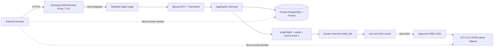

# OpsMate Local 공개 데모 설계

## 문서 상태

- 상태: `implemented`, `tested-component`
- 실제 모델 adapter E2E: `verified` (`2026-08-23`)
- Synology internal deployment/network/security/lifecycle E2E: `verified` (`2026-08-25`)
- 아직 미검증: DSM Reverse Proxy/TLS public ingress와 Internet/LTE 외부 smoke
- 최신 내부 증거: [`NAS_INTERNAL_E2E_EVIDENCE.md`](NAS_INTERNAL_E2E_EVIDENCE.md)

전체 ERP나 실제 조직 인증 시스템을 재현하는 것이 목적이 아닙니다. **자연어 구매 요청 -> 모델 기반 구조화 초안 -> 사람 승인 -> 발주 -> 감사 기록**의 수직 업무 흐름에서 AI와 업무 트랜잭션의 통제 경계를 보여주는 것이 목적입니다.

## 현재 배포 아키텍처



### 왜 DSM + loopback Nginx인가

Synology runtime 실측에서 80/443은 DSM이 이미 사용하고 있습니다. OpsMate가 별도 public edge로 해당 포트를 점유하면 기존 NAS ingress와 충돌하므로 DSM이 공개 TLS를 담당하고 OpsMate Nginx edge는 NAS loopback high port만 사용합니다.

내부 E2E에서 edge는 `127.0.0.1:18083`에만 bind했고 다음 경계를 실제 검증했습니다.

- `/actuator/**` 차단
- security headers와 live marker
- 익명 요청 rate limit과 `429`
- app/edge direct internet egress 차단
- PostgreSQL/app/model-tunnel host port 없음

### 왜 SSH tunnel인가

Office native Ollama는 유지하되 공개 데모 때문에 별도 model port를 인터넷이나 NAS host에 노출하지 않습니다. Synology의 non-root `model-tunnel`이 restricted SSH를 통해 승인된 model host의 loopback Ollama만 전달합니다.

- Ollama `11434`는 인터넷에 publish하지 않습니다.
- tunnel `11434`도 Synology host port로 publish하지 않습니다.
- app은 `http://model-tunnel:11434`만 allowlist합니다.
- app 자체는 일반 인터넷 egress network에 연결하지 않습니다.
- tunnel만 별도 egress network를 가집니다.
- SSH destination은 model loopback endpoint 하나로 제한합니다.
- exact host key pin과 `StrictHostKeyChecking=yes`를 사용합니다.

이 경로는 `2026-08-25` Synology internal E2E에서 실제 모델 요청까지 PASS했습니다.

## 공개 demo 프로필

- Spring MVC + Thymeleaf 동일 출처 UI
- HttpSession 기반 `DemoPrincipal`
- CSRF 검증
- `Secure`, `HttpOnly`, `SameSite=Lax` session cookie
- COOKIE-only session tracking; URL `;jsessionid` fallback 금지
- 서버가 생성한 `workspaceId`와 persona
- 외부 `/api/**` 거부
- 외부 `/actuator/**` 차단
- 브라우저가 actor, workspace 또는 권한을 임의 지정하지 못함

내부 E2E에서 실제 Secure XSRF/JSESSIONID cookie 흐름과 서로 다른 workspace 격리를 확인했습니다.

## 사용자 흐름

한 방문자는 하나의 합성 workspace에서 다음 persona를 순서대로 체험합니다.

1. `REQUESTER`: 자연어 구매 요청 -> 모델 초안/정책 근거 -> 승인 대기 제출
2. `APPROVER`: 현재 workspace의 승인 대기 요청 승인 또는 반려
3. `BUYER`: 승인된 요청 한 건당 발주 한 건 생성
4. `AUDITOR`: 요청·발주·감사 이벤트 타임라인 확인

persona 전환은 데모 체험용일 뿐 실제 조직 인증을 대체하지 않습니다. endpoint RBAC, service RBAC, workspace 범위와 도메인 상태 전이는 서버에서 계속 검증합니다.

## workspace·DB 통제

모든 쓰기와 조회는 `workspace_id` 조건을 포함합니다. 전역 조회 후 애플리케이션에서 필터링하는 방식은 공개 경로에서 사용하지 않습니다. workspace에는 TTL이 있으며 정상 종료와 cleanup은 합성 workspace 관련 데이터를 삭제합니다.

공개 프로필은 PostgreSQL 16 + `ddl-auto=validate`를 사용하며 DB admin, Flyway migration, runtime app 역할을 분리합니다. `migrate`는 동일 app image의 one-shot 실행이고 runtime app에는 migration credential이 없습니다.

내부 lifecycle E2E에서 normal close의 synthetic workspace purge와 PostgreSQL persistent volume 보존을 실제 확인했습니다.

## 모델 호출 통제

`DraftGenerationCoordinator`는 다음을 적용합니다.

- `(workspaceId, actor, idempotencyKey)` single-flight
- workspace/global quota
- 전체 모델 동시 실행 수 `1`
- bounded queue/follower wait
- timeout / malformed / oversized / unavailable fail-closed

모델 출력은 제안일 뿐 최종 업무 데이터가 아닙니다. 서버가 구조, 카테고리, 정책 ID와 업무 규칙을 다시 검증한 뒤에만 저장 단계로 이동합니다. 유료 외부 API로 자동 fallback하지 않습니다.

## 공개 배포 network 경계

| network | 연결 서비스 | 외부 egress |
|---|---|---|
| `edge_to_app` | Nginx edge, app | 없음 (`internal`) |
| `app_to_db` | app, migrate, DB | 없음 (`internal`) |
| `model_link` | app, model-tunnel | 없음 (`internal`) |
| `tunnel_egress` | model-tunnel | 승인된 SSH 접속만 필요 |

PostgreSQL, app, model-tunnel에는 host port mapping이 없습니다. Nginx edge 하나만 NAS loopback에 publish됩니다.

## 이미지와 공급망

현재 검증 release:

```text
source=f99686981da7efb8802635ae2bde5b0f781433ad
app=ghcr.io/son1004007/opsmate-local@sha256:61e267c05bf0ce0ea932ae62a3989194bd2a0065532d0ee4caee8b37c8f9d40b
tunnel=ghcr.io/son1004007/opsmate-model-tunnel@sha256:7fc133485a8ba60190e55b5eeb2da8b5eb02c1aa7e70e0cc0ce7b723746db1df
```

두 runtime image는 non-root이며 read-only root filesystem, dropped capabilities, `no-new-privileges` 경계를 사용합니다. Publish workflow의 immutable pull verification과 Synology runtime pull/stage를 모두 확인했습니다.

## 공개 전 gate

- [x] 전체 Maven/Java regression
- [x] PostgreSQL migration rehearsal
- [x] 실제 `gemma3:12b` adapter E2E
- [x] Synology Docker/x86_64 runtime
- [x] immutable app/tunnel GHCR digest 발행·pull verification
- [x] destination-restricted SSH key/host-key pin 경계
- [x] NAS -> restricted model-tunnel -> Ollama 실제 model flow
- [x] internal port/network/egress/security gate
- [x] internal rate limit `429`
- [x] internal persona/workspace isolation
- [x] normal close + same-digest reopen + emergency close + final `CLOSED`
- [ ] DSM Reverse Proxy/TLS public ingress
- [ ] Internet/LTE public persona smoke
- [ ] 외부 DB/model 비노출
- [ ] public-origin session/rate/security 재검증
- [ ] public-origin close/reopen smoke

전체 인터넷 공개 gate가 끝나기 전에는 프로젝트 전체 상태를 `verified public service`로 표현하지 않습니다.

## DSM public ingress

현재 후보 구조는 다음과 같습니다.

```text
public HTTPS: <Synology DDNS hostname>:58889
DSM destination: http://127.0.0.1:18083
```

`58889`는 실제 DSM/router 설정과 외부 검증이 끝나기 전까지 검증된 public port가 아닙니다. TLS 인증서는 public hostname과 일치해야 합니다.

## 공개 smoke 기준

실제 HTTPS origin에서 다음을 검증합니다.

- root/live marker
- 공개 `/api/**` 거부와 Basic challenge 부재
- cookie 보안 속성
- 합성 workspace 생성
- 실제 모델 기반 draft
- submit -> approve -> order
- AUDITOR audit event
- workspace cleanup
- 서로 다른 두 외부 세션 cross-workspace 격리
- 외부 PostgreSQL/model port 차단
- public `429` rate-limit
- LTE/5G 외부 접근

## lifecycle

### normal close

`deploy/close-demo.sh`는 Nginx edge -> app -> model-tunnel 순으로 중단하고 합성 workspace를 삭제한 뒤 DB를 닫습니다. PostgreSQL persistent volume은 보존하고 ephemeral tunnel-secret volume은 제거합니다. 이 내부 경로는 실제 Synology E2E에서 PASS했습니다.

### emergency close

`deploy/emergency-close.sh`는 env/credential 없이 Compose label을 사용해 해당 OpsMate project의 edge, app, model-tunnel, migrate, DB만 중단합니다. 다른 NAS workload나 공유 native Ollama를 중단하지 않습니다. 실제 Synology rehearsal에서 PASS했습니다.

### reopen

같은 app/tunnel image digest로 다시 열고 tunnel health, migration/readiness, session/model flow를 재통과해야 same-artifact reopen으로 인정합니다. 내부 same-digest reopen은 PASS했으며 public origin smoke는 ingress 구성 후 별도 검증합니다.

세부 명령과 장애 대응은 [`SERVICE_RUNBOOK.md`](SERVICE_RUNBOOK.md)를 따릅니다.

## 공개 증거 원칙

공개 가능한 것은 설계, 모델명, 소스 commit, image digest, 검증 시각/결과와 알려진 제한입니다. 실제 host/IP/user, SSH key, known_hosts 원문, 조직 승인 문서 원문과 runtime credential은 공개하지 않습니다.
