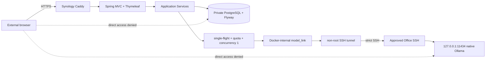

# OpsMate Local 공개 데모 설계

## 문서 상태

- 상태: `implemented`, `tested-component`; 실제 모델 adapter E2E 경계 `verified`
- 대상: 채용 담당자가 브라우저에서 직접 실행할 수 있는 제한형 공개 데모
- 실제 모델 증거: `2026-08-23` Ollama `gemma3:12b`, 9/9 성공, 관측 p95 21,076ms(`<= 30,000ms` gate)
- 아직 미검증: 실제 public URL, NAS -> SSH tunnel -> Office Ollama 전체 경로, 외부 DB/model 비노출, edge rate limit, close/reopen rehearsal

전체 ERP나 실제 조직 인증 시스템을 재현하는 것이 목적이 아닙니다. **자연어 구매 요청 -> 모델 기반 구조화 초안 -> 사람 승인 -> 발주 -> 감사 기록**의 수직 업무 흐름에서 AI와 업무 트랜잭션의 통제 경계를 보여주는 것이 목적입니다.

## 현재 배포 아키텍처



### 왜 SSH tunnel인가

Office 실측 결과 native Ollama는 동작하지만 Docker는 설치되어 있지 않습니다. 따라서 공개 데모 때문에 Office에 별도 Docker/NVIDIA model-host stack을 추가하지 않습니다.

대신 Synology의 `model-tunnel` 컨테이너가 기존 Office SSH endpoint에 접속해 **Office loopback `127.0.0.1:11434` 한 곳만** 전달합니다.

- Ollama `11434`는 인터넷에 publish하지 않습니다.
- tunnel `11434`도 Synology host port로 publish하지 않습니다.
- app은 `http://model-tunnel:11434`만 allowlist합니다.
- app 자체는 일반 인터넷 egress network에 연결하지 않습니다.
- tunnel만 별도 egress network를 가집니다.
- 실제 Office SSH key는 destination-restricted `permitopen="127.0.0.1:11434"` 경계로 등록해야 합니다.
- Office SSH host key는 exact known_hosts로 pin하고 `StrictHostKeyChecking=yes`를 사용합니다.

## 공개 demo 프로필

- Spring MVC + Thymeleaf 동일 출처 UI
- HttpSession 기반 `DemoPrincipal`
- CSRF 검증
- `Secure`, `HttpOnly`, `SameSite=Lax` session cookie
- 서버가 생성한 `workspaceId`와 persona
- 외부 `/api/**` 거부
- 외부 `/actuator/**` 차단
- 브라우저가 actor, workspace 또는 권한을 임의 지정하지 못함

기존 stateless Basic REST API는 로컬/자동화 검증 프로필에만 유지하며 공개 `demo` 프로필에서는 업무 흐름 우회 경로로 사용하지 않습니다.

## 사용자 흐름

한 방문자는 하나의 합성 workspace에서 다음 persona를 순서대로 체험합니다.

1. `REQUESTER`
   - 자연어 구매 요청 입력
   - 모델 초안과 정책 근거 확인
   - 승인 대기로 제출
2. `APPROVER`
   - 현재 workspace의 승인 대기 요청 조회
   - 승인 또는 사유가 있는 반려
3. `BUYER`
   - 승인된 요청 조회
   - 요청 한 건당 발주 한 건 생성
4. `AUDITOR`
   - 요청·발주·감사 이벤트 타임라인 확인

persona 전환은 데모 체험용일 뿐 실제 조직 인증을 대체하지 않습니다. endpoint RBAC, service RBAC, workspace 범위와 도메인 상태 전이는 서버에서 계속 검증합니다.

## workspace 격리

`POST /demo/sessions`는 서버가 새 UUID workspace를 만들고 SecurityContext에 현재 workspace/persona를 저장합니다.

모든 쓰기와 조회는 `workspace_id` 조건을 포함합니다. 전역 조회 후 애플리케이션에서 필터링하는 방식은 공개 경로에서 사용하지 않습니다.

workspace에는 TTL이 있으며 만료되면 세션과 SecurityContext를 폐기합니다. 정상 데모 종료와 cleanup은 합성 workspace 관련 데이터를 삭제합니다.

## PostgreSQL과 migration 경계

공개 프로필은 PostgreSQL 16 + `ddl-auto=validate`를 사용합니다.

- DB admin 역할
- Flyway migration 역할
- runtime app 역할

을 분리합니다. `migrate`는 **동일 app image**를 one-shot으로 실행하며 runtime app에는 migration credential을 주입하지 않습니다.

주요 무결성 경계:

- workspace FK 및 cascade cleanup
- request/order idempotency unique constraint
- workspace + status 기반 작업함 index
- workspace + occurred_at 기반 audit index

PostgreSQL Testcontainers 경로로 migration/constraint/role 동작을 검증합니다.

## 모델 호출 통제

`DraftGenerationCoordinator`는 모델 호출 전에 다음을 적용합니다.

- `(workspaceId, actor, idempotencyKey)` single-flight
- workspace/global quota
- 전체 모델 동시 실행 수 `1`
- bounded queue/follower wait
- timeout / malformed response / unavailable fail-closed

모델 출력은 제안일 뿐 최종 업무 데이터가 아닙니다. 서버가 구조, 카테고리, 정책 ID와 업무 규칙을 다시 검증한 뒤에만 저장 단계로 이동합니다.

## 모델 endpoint 통제

런타임 app 설정은 다음으로 고정합니다.

```text
OPSMATE_LLM_BASE_URL=http://model-tunnel:11434
OPSMATE_LLM_ALLOWED_HOSTS=model-tunnel
```

`LlmGatewayConfiguration`은 URL scheme/host/path를 검증하고 allowlist 밖 host를 시작 단계에서 거부합니다. SSH-forwarded loopback 경로에서는 별도 model API Bearer token을 사용하지 않으며, 네트워크 인증/목적지 제한은 SSH key + exact host key + `permitopen`으로 수행합니다.

## 공개 배포 네트워크

Compose network 의도:

| network | 연결 서비스 | 외부 egress |
|---|---|---|
| `edge` | Caddy | 필요 |
| `edge_to_app` | Caddy, app | 없음 (`internal`) |
| `app_to_db` | app, migrate, DB | 없음 (`internal`) |
| `model_link` | app, model-tunnel | 없음 (`internal`) |
| `tunnel_egress` | model-tunnel | Office SSH 접속용 |

PostgreSQL과 model tunnel에는 host port mapping이 없습니다.

## 이미지와 공급망

app과 model-tunnel 이미지는 GitHub Actions에서 GHCR로 발행하며 실제 배포는 full digest를 사용합니다.

```text
OPSMATE_APP_IMAGE=ghcr.io/.../opsmate-local:<sha>@sha256:<digest>
OPSMATE_TUNNEL_IMAGE=ghcr.io/.../opsmate-model-tunnel:<sha>@sha256:<digest>
```

두 runtime image 모두 non-root이며 read-only root filesystem, dropped capabilities, `no-new-privileges` 경계를 사용합니다.

## 공개 전 gate

- [x] Maven/Java regression
- [x] PostgreSQL migration rehearsal
- [x] 실제 `gemma3:12b` adapter E2E
- [x] Synology Docker/x86_64 runtime 확인
- [x] Office native Ollama/model 확인
- [x] Office 사용 승인 확인
- [ ] app/tunnel immutable GHCR digest 발행 및 pull 검증
- [ ] destination-restricted Office SSH key bootstrap
- [ ] NAS -> model-tunnel -> Office Ollama 실제 health
- [ ] Synology public hostname/TLS 확정
- [ ] public edge rate limit
- [ ] public smoke
- [ ] 외부 DB/model 비노출
- [ ] normal/emergency close + same-digest reopen

위 외부 gate가 끝나기 전에는 프로젝트 전체 상태를 `tested-component`보다 높이지 않습니다.

## 공개 smoke 기준

실제 HTTPS에서 다음을 검증합니다.

- root/live marker
- HTTP -> HTTPS redirect
- 공개 `/api/**` 거부
- cookie 보안 속성
- 합성 workspace 생성
- 실제 모델 기반 draft
- submit -> approve/reject -> order
- AUDITOR audit event
- workspace cleanup

추가로 서로 다른 두 외부 세션의 cross-workspace 격리와 LTE/5G UX를 확인합니다.

## lifecycle

### normal close

`deploy/close-demo.sh`는 Caddy -> app -> model-tunnel 순으로 중단하고 합성 workspace를 삭제한 뒤 DB를 닫습니다.

### emergency close

`deploy/emergency-close.sh`는 env/credential 없이 Compose label을 사용해 해당 OpsMate project의 Caddy, app, model-tunnel, migrate, DB만 중단합니다. 다른 NAS workload나 Office Ollama를 중단하지 않습니다.

### reopen

같은 app/tunnel image digest로 다시 열고 tunnel health, migration/readiness, public smoke를 재통과해야 same-artifact reopen으로 인정합니다. rehearsal 종료 후 최종 상태는 다시 `CLOSED`로 둡니다.

세부 명령과 장애 대응은 [`SERVICE_RUNBOOK.md`](SERVICE_RUNBOOK.md)를 따릅니다.

## 공개 증거 원칙

공개 가능한 것은 설계, 모델명, 소스 commit, image digest, 검증 시각/결과와 알려진 제한입니다.

실제 host/IP/user, SSH key, known_hosts 원문, 조직 승인 문서 원문과 runtime credential은 공개하지 않습니다.
