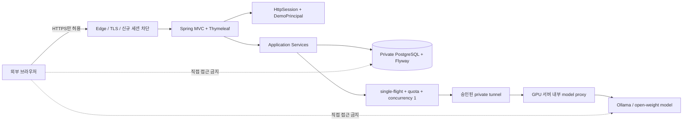

# OpsMate Local 공개 데모 설계

## 문서 상태

- 상태: `implemented`, `tested-component`; 실제 모델 adapter E2E 경계 `verified`
- 대상: 채용 담당자가 브라우저에서 직접 실행할 수 있는 제한형 공개 데모
- 현재 구현 범위: Thymeleaf session UI, workspace 격리·TTL, CSRF와 API 거부, model guard, PostgreSQL/Flyway 역할 분리, Docker/Caddy와 open/close 자산, `2026-08-23` 실제 `gemma3:12b` E2E
- 아직 증명하지 않은 범위: 공개 URL과 외부 smoke, host egress allowlist와 edge/WAF rate limit, DB/model 외부 비노출, 양 호스트 close/reopen rehearsal

이 문서는 구현된 공개 데모의 계약과 아직 남은 외부 검수 기준을 함께 정의합니다. `2026-08-04` 전체 `clean verify`에서 54개 테스트가 성공했고 실패·오류·건너뜀은 0개였습니다. `2026-08-23` 사설 GPU 호스트의 Ollama `gemma3:12b`로 실제 모델 E2E 9/9와 관측 p95 21,076ms(`<= 30,000ms` gate)를 확인했습니다. 상세 환경과 한계는 [`REAL_MODEL_E2E_EVIDENCE.md`](REAL_MODEL_E2E_EVIDENCE.md)에 기록합니다. 공개 URL·외부 네트워크 정책과 양 호스트 lifecycle 검수가 끝나기 전에는 프로젝트 전체 상태를 `tested-component`로 유지합니다.

## 목표

공개 데모는 다음 질문에 실행 가능한 결과로 답해야 합니다.

1. 자연어 구매 요청을 로컬 오픈웨이트 모델이 정책 근거가 있는 구조화 초안으로 바꿀 수 있는가?
2. 모델의 제안과 사람의 승인, 업무 트랜잭션을 분리했는가?
3. 역할, 상태 전이, 멱등성, 중복 발주 방지와 감사 기록을 서버가 최종 통제하는가?
4. 모델 장애와 잘못된 출력에서 모델 의존 초안 생성을 저장 전 중단하는가?
5. 서로 다른 공개 방문자의 합성 데이터가 섞이지 않는가?

전체 ERP나 실제 조직 인증 시스템을 재현하는 것은 목표가 아닙니다. 구매 요청에서 발주·감사까지 하나의 수직 업무 흐름과 안전한 AI 통합 경계를 보여주는 것이 목표입니다.

## 확정 아키텍처

외부에 공개하는 것은 edge가 전달하는 HTTPS 웹 애플리케이션뿐입니다. PostgreSQL과 Ollama는 사설 네트워크에 두고 공인 주소나 공개 포트로 노출하지 않습니다.

## 실행 프로필과 보안 체인

### 공개 `demo` 프로필

- Spring MVC와 Thymeleaf로 동일 출처 UI를 제공합니다.
- HttpSession을 사용합니다.
- 웹 쓰기 요청에는 CSRF 검증을 적용합니다.
- 세션 쿠키는 `Secure`, `HttpOnly`, `SameSite=Lax`로 설정했습니다. 실제 HTTPS 응답 속성은 외부 smoke에서 다시 확인합니다.
- `DemoPrincipal`은 서버가 생성한 `workspaceId`와 현재 `persona`를 가집니다.
- 브라우저가 `workspaceId`, actor 또는 권한을 요청 본문으로 지정할 수 없게 합니다.
- stateless Basic API 인증은 비활성화하거나 명시적으로 거부합니다.
- Caddy는 외부 `/actuator/**`를 `404`로 차단하고, 앱의 내부 health는 상세 환경·모델 주소·비밀값을 반환하지 않습니다.

### 로컬 API 검증 프로필

- 기존 stateless Basic Auth API는 로컬·자동화 테스트 범위에서만 유지합니다.
- 이 프로필은 공개 edge 뒤에 배포하지 않습니다.
- 공개 `demo` 프로필과 동시에 활성화하지 않습니다.

웹 체인과 API 체인은 경로와 프로필을 명시적으로 분리했습니다. 공개 `demo` 프로필에서 `/api/**`는 정확히 `403`을 반환하고 `WWW-Authenticate: Basic` challenge를 만들지 않는지 smoke test가 확인합니다.

## 사용자 화면과 업무 흐름

### 시작 화면

- 프로젝트 목적과 구현 범위를 설명합니다.
- 합성 데이터만 사용하며 개인정보·조직 정보·비밀값을 입력하지 말라는 경고를 표시합니다.
- 모델의 구성 여부만 `연동 구성` 또는 `사용 불가`로 표시하며 live health 상태는 노출하지 않습니다.
- 내부 호스트, 포트, 토큰과 전체 health detail은 표시하지 않습니다.
- 사용자가 `데모 시작`을 선택해야 새로운 workspace를 만듭니다.

### 데모 대시보드

화면은 다음 네 persona를 단계 순서대로 보여줍니다.

1. `REQUESTER`
   - 자연어 구매 요청 입력
   - 모델이 만든 초안과 정책 근거 확인
   - 자신의 초안을 승인 대기로 제출
2. `APPROVER`
   - 현재 workspace의 승인 대기 작업함 조회
   - 승인 또는 사유가 있는 반려 실행
3. `BUYER`
   - 현재 workspace의 승인 완료 작업함 조회
   - 승인된 요청 한 건당 발주 한 건 생성
4. `AUDITOR`
   - 현재 workspace의 요청·발주·감사 이벤트 타임라인 조회

persona 전환은 공개 데모를 한 방문자가 전체 흐름을 체험하기 위한 기능입니다. 실제 운영 인증이나 직무 분리의 대체물이 아님을 화면과 문서에 표시합니다. 전환 후에도 endpoint RBAC, service method RBAC, workspace 범위와 도메인 상태 전이를 모두 통과해야 합니다.

## DemoPrincipal과 workspace 격리

`POST /demo/sessions`는 다음 순서로 동작합니다.

1. 기존 HttpSession에 활성 `DemoPrincipal`이 있으면 같은 workspace로 수렴시키고, 만료된 workspace는 닫습니다.
2. 전역 시작률과 active workspace 수용량을 검사합니다.
3. 검사에 성공한 경우에만 추측하기 어려운 UUID workspace와 만료 시각을 PostgreSQL에 저장합니다.
4. DB 저장이 끝난 뒤에만 HttpSession을 만들고 session ID를 회전합니다.
5. controller가 최초 persona `REQUESTER`와 workspace 식별자를 가진 `DemoPrincipal`을 SecurityContext에 저장합니다.
6. 이후 요청에서는 session security context가 인증을 복원하고, application service는 `ActorContext`에서 workspace와 actor를 가져옵니다.

모든 쓰기, 상세 조회, 목록 조회와 감사 조회는 `workspace_id`를 조건으로 사용합니다. 전역 `findById`, `findAll`을 먼저 수행한 뒤 애플리케이션에서 거르는 방식은 공개 데모 경로에서 사용하지 않습니다.

이후 요청에서는 Spring Security가 먼저 session의 SecurityContext를 복원합니다. `ActorProvider`가 DB의 workspace ACTIVE/TTL을 다시 확인해 비활성·만료 상태를 거부하고, 예외 처리기가 SecurityContext와 HttpSession을 비운 뒤 시작 화면으로 돌려보냅니다. 사용자는 새 workspace로 데모를 다시 시작해야 하며, 만료된 workspace와 관련 합성 데이터는 주기적으로 삭제합니다.

## 공개 데모 웹 명령과 로컬 API 분리

공개 UI는 `/demo/**` Spring MVC route와 server-side form을 사용합니다. controller는 현재 `DemoPrincipal`을 기준으로 application service를 호출하고 Thymeleaf 화면을 다시 렌더링합니다.

| 메서드와 경로 | 공개 demo 역할 | workspace 규칙 |
|---|---|---|
| `GET /` | 익명 시작 화면 | 설명, 입력 주의사항과 제한된 모델 상태 표시 |
| `POST /demo/sessions` | 익명 시작 화면 | 서버가 새 workspace 생성 |
| `GET /demo` | 활성 demo session | 현재 persona의 작업함과 진행 단계 렌더링 |
| `POST /demo/personas` | 활성 demo session | 서버 allowlist 안의 persona만 전환 |
| `POST /demo/reset` | 활성 demo session | 현재 workspace 합성 데이터 삭제 후 새 workspace 생성 |
| `POST /demo/drafts` | REQUESTER | 현재 workspace와 actor를 서버가 주입 |
| `POST /demo/requests/{id}/submit` | REQUESTER | 현재 workspace의 자신의 초안만 허용 |
| `POST /demo/requests/{id}/decisions` | APPROVER | 현재 workspace의 승인 대기 요청만 허용 |
| `POST /demo/orders` | BUYER | 현재 workspace의 승인된 요청만 허용 |
| `POST /demo/end` | 활성 demo session | 현재 workspace 합성 데이터 삭제와 세션 종료 |

작업함, 상세 정보와 감사 타임라인은 `GET /demo`의 server-side query에서 역할·상태·소유권·workspace 조건으로 조회합니다. 목록은 정렬과 최대 건수를 서버에서 제한합니다.

기존 `/api/**` REST controller는 로컬·자동화 검증용 stateless Basic chain에만 속합니다. 공개 `demo` 프로필에서는 이 Basic chain을 만들지 않거나 `/api/**`를 명시적으로 거부합니다. 따라서 공개 브라우저는 Basic credential이나 `/api/**` 경로로 업무 흐름을 우회할 수 없습니다.

## PostgreSQL과 Flyway

공개 `demo` 프로필은 PostgreSQL과 `ddl-auto=validate`를 사용합니다. Flyway는 장기 실행 앱과 분리된 one-shot `migrate` 컨테이너가 먼저 실행하므로 runtime 앱에는 migration credential이 없습니다.

`demo_workspaces`는 다음 최소 필드를 가집니다.

- `id`
- `created_at`
- `expires_at`
- `state`

`purchase_requests`, `purchase_orders`, `audit_events`에는 `workspace_id NOT NULL`을 추가합니다. 다음 제약과 인덱스를 DB에 둡니다.

- 초안 멱등성: `(workspace_id, requested_by, idempotency_key)` 고유 제약
- 발주 멱등성: `(workspace_id, created_by, idempotency_key)` 고유 제약
- 요청 작업함: `(workspace_id, status, updated_at)` 인덱스
- 감사 타임라인: `(workspace_id, occurred_at)` 인덱스
- workspace 삭제 시 관련 합성 데이터 cascade 삭제

DB admin, migration, runtime 역할을 분리합니다. runtime 역할은 필요한 DML만 수행하고 임의 DDL과 Flyway history 조회가 거부되도록 migration callback으로 권한을 제한합니다. H2는 로컬 단위·컴포넌트 테스트에만 사용하고, Flyway migration·역할 분리·실제 제약과 cascade는 PostgreSQL Testcontainers 검증 경로를 둡니다.

## 모델 호출 통제

모델 호출 전 `DraftGenerationCoordinator`가 다음 순서로 통제합니다.

1. `(workspaceId, actor, idempotencyKey)`로 최초 요청을 single-flight 소유자로 등록하고 같은 요청은 기존 flight에 합류시킵니다.
2. follower 수와 결과 대기 시간을 제한하며, follower는 별도 모델 호출이나 quota 차감을 하지 않습니다.
3. flight 소유자만 workspace별 호출 한도와 workspace 삭제로 초기화되지 않는 전체 호출 한도를 차감합니다.
4. 소유자가 공정한 semaphore를 제한된 시간 동안 획득하며, 공개 데모의 전체 모델 동시 실행 수를 `1`로 제한합니다.
5. 한도, follower 수나 queue 대기를 넘기면 명시적인 rate/busy 오류로 종료합니다.
6. 모델 호출·구조 검증이 성공한 뒤에만 기존 트랜잭션 저장 단계로 이동합니다.
7. 성공 또는 실패 결과를 follower에게 전달한 뒤 완료된 flight를 제거합니다.

모델 timeout, HTTP 오류, 빈 응답, 스키마 불일치, 정책 근거 불일치에서는 해당 초안을 저장하지 않습니다. 이미 제출된 요청의 승인·반려·발주는 모델 가용성과 무관하게 기존 서버 규칙을 따릅니다. 다른 모델이나 유료 API를 호출하는 fallback은 구현하지 않습니다.

in-memory single-flight와 semaphore는 공개 데모를 단일 애플리케이션 인스턴스로 운영한다는 전제를 가집니다. 다중 인스턴스로 확장하려면 PostgreSQL 또는 별도 조정 저장소를 이용한 분산 제어를 먼저 구현해야 합니다.

## 승인된 사설 GPU 모델 호스트 사전 gate

조직 소유 자원을 포함한 사설 GPU 모델 호스트를 공개 데모에 사용하려면 아래 항목을 모두 만족해야 합니다.

- 외부 포트폴리오 트래픽 처리에 대한 명시적인 사용 승인
- GPU 정확한 제품명, VRAM, 드라이버와 container runtime 실측
- 선택한 오픈웨이트 모델의 라이선스와 조직 자산 사용 정책 검토
- 승인된 사설 tunnel과 host firewall 구성
- Ollama를 loopback 또는 사설 interface에만 bind
- 애플리케이션에서만 접근 가능한 model proxy 인증
- 사용 기간, 담당자, 중단과 계정·token 회수 절차 확정

승인이나 실측 gate가 하나라도 실패하면 모델 호스트 연결 작업을 중단합니다. 사용자의 별도 결정 없이 GPU cloud, 유료 API 또는 다른 외부 모델로 우회하지 않습니다.

## 네트워크 공개 기준

- 인터넷에서 접근 가능한 업무 서비스 포트는 HTTPS 하나뿐입니다.
- PostgreSQL 포트는 public interface에 bind하지 않습니다.
- Ollama 기본 포트는 public interface에 bind하지 않습니다.
- 애플리케이션에서 모델로 가는 경로는 승인된 private tunnel과 firewall allowlist를 통과합니다.
- Caddy는 TLS 종료와 16KB 요청 본문 제한을 적용합니다.
- 인터넷 edge/WAF의 익명 요청 rate limit과 app host의 모델 목적지 egress allowlist는 외부 배포에서 적용·증명해야 하며, 증거 flag가 없으면 open script가 중단됩니다.
- 애플리케이션은 proxy 전달 헤더를 신뢰할 대상을 제한합니다.
- 내부 주소, tunnel 정보, 인증 token과 상세 stack trace는 응답과 로그에 남기지 않습니다.

## 공개 완료 검수 기준

### 기능

- 외부 브라우저에서 별도 설치 없이 전체 persona 흐름을 완료한다.
- 요청 생성, 제출, 승인 또는 반려, 발주와 감사 타임라인이 일관된다.
- 모델이 사용 불가할 때 초안 생성은 저장 전에 중단되고 명확한 오류를 표시한다.
- PostgreSQL 재기동과 migration 검증을 통과한다.

### 격리와 보안

- 서로 다른 두 브라우저 세션이 요청·발주·감사 데이터를 볼 수 없다.
- 다른 workspace의 UUID를 직접 요청해도 존재 여부와 데이터가 노출되지 않는다.
- CSRF token 없는 웹 쓰기는 거부한다.
- 공개 `demo` 프로필에서 Basic API 로그인이 동작하지 않는다.
- Ollama와 PostgreSQL은 외부 네트워크에서 접근되지 않는다.
- 저장소, 이미지, 로그와 검증 산출물에 credential이 없다.

### 동시성과 모델

- 같은 idempotency key의 동시 요청에서 모델 호출과 DB 저장이 각각 한 번이다.
- 전체 동시 모델 호출이 한 건으로 제한되고 나머지는 제한된 queue 또는 busy 결과를 받는다.
- `2026-08-23` 실제 `gemma3:12b` E2E에서 정상 구조 출력과 관측 p95 21,076ms를 기록했습니다. malformed·timeout·unavailable의 fail-closed 경계는 자동화 테스트로 검증하며 실제 endpoint 장애 주입 검수는 별도 외부 gate로 보완합니다.
- 실제 모델 E2E는 유효 응답의 구조 검증→서버 업무 검증→저장 경계를 확인했습니다. 검증 실패 전 DB 무쓰기 경계는 자동화된 실패 테스트로 유지합니다.

### 외부 운영

- 외부 모바일 네트워크에서 live URL과 전체 업무 흐름을 확인한다.
- 앱 호스트와 모델 호스트의 별도 close·closed verification을 모두 통과한다.
- 서비스 close 뒤 live 업무 URL, 원본 앱과 모델 endpoint에 접근할 수 없다.
- reopen은 같은 애플리케이션 image digest와 승인 모델 content ID를 사용하고 health와 smoke test를 다시 통과한다.

## 공개 증거 갱신 원칙

코드와 배포 자산이 있는 항목은 `implemented`, 명시된 자동화 검증 경로가 있는 항목은 `tested-component`로 표시합니다. 실제 모델 adapter E2E 경계는 `2026-08-23` 검증 근거로 `verified`입니다. 공개 URL, 외부 smoke, 외부 네트워크 정책 증거와 양 호스트 close/reopen 검수가 모두 끝난 뒤에만 공개 운영 완료 문구와 검증 날짜를 README, 아키텍처 문서와 portfolio evidence에 반영합니다.

사설 host, IP, 계정, 내부 URL, 승인 문서 원문과 운영 credential은 공개 증거에 포함하지 않습니다. 공개 기록에는 일반화한 구성, 모델명·라이선스, 검증 시각, 결과와 제한만 남깁니다.