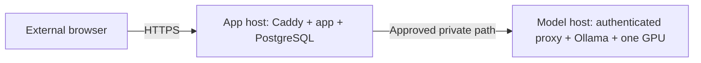

# OpsMate Local 공개 데모 운영 Runbook

## 문서 상태

- 상태: 운영 자산 `implemented`, 실제 모델 adapter E2E `verified`, 실제 양 호스트 rehearsal `unverified`
- 목적: 필요한 기간에만 서비스를 열고, 개발·검증 뒤 안전하게 닫았다가 같은 artifact로 다시 여는 절차
- 기본 상태: `CLOSED`
- 공개 금지: credential, host/IP, 내부 URL, VPN 정보와 승인 문서 원문

현재 저장소에는 앱·모델 호스트의 open, normal close, emergency close와 closed verification 스크립트가 있습니다. `2026-08-23` 최신 PR regression에서 OpsMate `clean verify`, container/config 검증, non-root image build와 one-shot migration rehearsal이 모두 성공했습니다. 같은 날 사설 GPU 호스트의 Ollama `gemma3:12b` 실제 모델 adapter E2E도 9/9와 p95 21,076ms(`<= 30,000ms`)로 성공했습니다. 다만 공개 포트폴리오 트래픽용 model-host 배포 gate, 공개 URL과 양 호스트를 사용한 전체 lifecycle rehearsal은 아직 수행하지 않았습니다. 스크립트 존재나 제한된 실제 모델 E2E를 실제 공개 운영 완료로 해석하지 않습니다.

## 두 호스트의 책임



애플리케이션 호스트와 모델 호스트는 별도 수명주기를 가집니다.

| 대상 | open | normal close | emergency close | closed 확인 |
|---|---|---|---|---|
| 애플리케이션 호스트 | `deploy/open-demo.sh` | `deploy/close-demo.sh` | `deploy/emergency-close.sh [project]` | `deploy/verify-closed.sh` |
| 모델 호스트 | `deploy/model-host/open-model.sh` | `deploy/model-host/close-model.sh` | `deploy/model-host/emergency-close.sh [project]` | `deploy/model-host/verify-private.sh --closed` |

앱 close만으로 GPU가 해제되지 않고, 모델 close만으로 public edge와 DB가 닫히지 않습니다. 두 호스트의 close와 verification이 모두 성공해야 전체 서비스를 `CLOSED`로 판정합니다.

모든 Compose service는 `restart: "no"`입니다. Docker daemon이나 호스트 재시작만으로 공개 서비스가 자동 복구되지 않으며, 항상 명시적인 open gate를 다시 통과해야 합니다.

## 비밀값과 환경 파일

각 호스트에서 예시 파일을 추적되지 않는 `.env`로 복사합니다.

```text
deploy/.env.example
deploy/model-host/.env.example
```

환경 파일에는 다음 유형의 값이 필요하지만 실제 값은 Git, 문서, issue, CI log와 shell history에 남기지 않습니다.

- 앱 image full digest와 공개 domain
- DB admin·migration·runtime 역할과 서로 다른 비밀번호
- 승인된 private model endpoint와 임시 Bearer token
- Ollama/Caddy image full digest와 승인 모델 tag·content ID
- 선택한 한 GPU와 승인된 VPN interface

`.env*`는 `.env.example`을 제외하고 ignore합니다. backup 이름을 포함한 비밀 파일도 커밋하지 않습니다.

## 공개 전 필수 gate

### 승인된 사설 GPU 모델 호스트

- [ ] 외부 포트폴리오 트래픽 처리 목적과 기간이 명시적으로 승인됨
- [ ] GPU·VRAM·driver·NVIDIA container runtime을 실측함
- [ ] 선택 모델의 license와 사용 범위를 검토함
- [ ] 모델 proxy는 승인된 private/VPN IPv4에만 bind함
- [ ] Ollama 자체 host port는 노출하지 않음
- [ ] Ollama image full digest, 모델 tag와 실제 content ID를 고정함
- [ ] 한 GPU만 선택하고 다른 workload를 변경하지 않음

`2026-08-23` 실제 모델 adapter E2E는 모델 호환성·구조화 출력·서버 검증·저장 경계를 확인한 증거입니다. 위 체크리스트는 **공개 포트폴리오 트래픽을 처리하는 실제 model-host 운영 gate**이므로 별도로 충족해야 합니다.

모델 `open-model.sh`는 승인 flag가 정확히 `YES`인지 Docker, GPU, network 또는 model 작업보다 먼저 확인합니다. 승인이 없으면 여기서 중단하고 유료 API나 다른 모델로 자동 전환하지 않습니다.

### 애플리케이션과 외부 네트워크

- [ ] 같은 소스에서 빌드·검증한 앱 image full digest를 registry에서 사용할 수 있음
- [ ] DB admin·migration·runtime 역할과 비밀번호가 서로 분리됨
- [ ] public domain, DNS와 ACME 조건이 준비됨
- [ ] app host firewall/egress가 승인 모델 목적지만 허용한다는 증거를 보관함
- [ ] edge/WAF가 익명 요청 rate limit을 적용한다는 증거를 보관함
- [ ] 최신 `clean verify`, container build와 구성 검사가 통과함

`open-demo.sh`는 egress allowlist와 edge rate limit의 증거 flag가 모두 `YES`가 아니면 실패합니다. flag는 실제 정책의 대체물이 아니므로 운영자가 외부 구성을 별도로 확인해야 합니다.

## 모델 호스트 열기

모델 호스트에서 실행합니다.

```sh
./deploy/model-host/open-model.sh
```

스크립트는 다음 순서를 지킵니다.

1. 승인 flag, 필수 명령, Docker/NVIDIA runtime과 환경값을 검사합니다.
2. VPN interface에 승인한 private IPv4가 실제로 할당됐는지 확인합니다.
3. GPU selector가 정확히 한 GPU를 가리키는지 `nvidia-smi`로 확인합니다.
4. Ollama·Caddy image가 full SHA-256 digest인지 검사합니다.
5. 모델에 명시적 tag와 승인 content ID가 있는지 검사합니다.
6. 기존 proxy를 먼저 멈춰 검증 중 endpoint 노출을 막습니다.
7. 선택한 한 GPU로 Ollama를 시작하고 승인 모델을 준비합니다.
8. 실제 model inventory의 content ID가 승인값과 같은지 확인합니다.
9. VPN-bound 인증 proxy를 시작합니다.
10. private bind, token 없는 요청의 `401`, 인증 health `200`, Ollama host port 미노출과 model volume을 확인합니다.

중간 실패 시 proxy와 Ollama를 멈추고 closed verification을 시도합니다. 자동 정리가 완전하지 않으면 앱 호스트를 열지 말고 모델 호스트를 먼저 점검합니다.

## 애플리케이션 호스트 열기

모델 호스트 검증 뒤 애플리케이션 호스트에서 실행합니다.

```sh
./deploy/open-demo.sh
```

preflight는 다음을 확인합니다.

- 앱 image가 full SHA-256 digest로 고정됨
- DB 역할 이름이 안전한 서로 다른 식별자이고 비밀번호 길이 기준을 만족함
- model proxy token이 길이·문자 기준을 만족함
- model base URL은 경로가 없는 승인된 private/VPN IPv4 한 개와 port로 구성됨
- allowed hosts는 해당 IPv4 하나와 정확히 같음
- private model health가 Bearer 인증으로 성공함
- host egress와 edge rate limit 증거 flag가 `YES`임
- Compose 구성이 유효함

시작 순서는 다음과 같습니다.

1. 기존 public Caddy를 중단합니다.
2. PostgreSQL을 시작하고 health를 기다립니다.
3. 검증한 immutable 앱 image digest를 pull·inspect합니다.
4. 같은 image의 one-shot `migrate`가 Flyway를 완료합니다.
5. migration credential이 없는 runtime 앱을 시작하고 readiness를 기다립니다.
6. Caddy를 시작합니다.
7. 외부 HTTPS smoke test를 실행합니다.

open 중 실패하면 public edge와 앱을 멈추고, 쓰기 주체가 실제로 중단된 경우에만 합성 workspace 삭제를 시도한 뒤 DB를 멈춥니다. 자동 정리 실패 메시지가 나오면 재시도 전에 emergency close와 수동 상태 확인을 수행합니다.

## 공개 smoke 기준

`deploy/smoke-test.sh`는 실제 HTTPS와 실제 모델 경로에서 다음을 확인합니다.

- public root 응답과 `X-OpsMate-Demo: live` marker
- HTTP→HTTPS redirect
- 공개 `/api/**`의 정확한 `403`과 Basic challenge 부재
- XSRF/JSESSIONID의 `Secure`, `HttpOnly`, `SameSite=Lax`
- `/demo/sessions`로 합성 workspace 시작
- `/demo/drafts`에서 실제 모델 기반 서버 검증 초안 생성
- `/demo/requests/{id}/submit`
- `/demo/requests/{id}/decisions`
- `/demo/orders`
- AUDITOR 화면의 `ORDER_CREATED`
- `/demo/end`를 통한 smoke workspace 삭제

이 smoke가 성공하지 않으면 공개 open은 완료된 것이 아닙니다. 서로 다른 두 외부 세션의 cross-workspace 격리, 외부 DB/model port 차단과 모바일 네트워크 확인은 별도 운영 검수로 추가합니다.

## 정상 애플리케이션 호스트 닫기

애플리케이션 호스트에서 실행합니다.

```sh
./deploy/close-demo.sh
```

실제 순서는 다음과 같습니다.

1. public Caddy를 먼저 중단합니다.
2. 앱을 graceful shutdown으로 중단해 신규 쓰기와 진행 중 트랜잭션을 끝냅니다.
3. Caddy와 앱이 모두 실제로 중단됐는지 확인합니다.
4. PostgreSQL을 시작하거나 유지하고 admin 역할로 `demo_workspaces`를 truncate cascade 합니다.
5. 남은 workspace 수가 `0`인지 확인합니다.
6. one-shot migration service와 PostgreSQL을 중단합니다.
7. app, migrate, DB와 live Caddy가 모두 중단됐고 PostgreSQL volume이 남아 있는지 `verify-closed.sh`로 확인합니다.

앱보다 먼저 합성 데이터를 삭제하면 늦게 완료되는 트랜잭션과 경합할 수 있으므로 이 순서를 바꾸지 않습니다. 삭제 검증이 실패해도 서비스 중단은 유지하고, 원인을 해결하기 전에는 reopen하지 않습니다.

## 정상 모델 호스트 닫기

모델 호스트에서 별도로 실행합니다.

```sh
./deploy/model-host/close-model.sh
```

스크립트는 VPN-bound proxy를 먼저 멈추고 Ollama를 멈춥니다. 이후 proxy·Ollama container 중단, 11434 listener 부재, 승인 private endpoint의 접근 불가와 model volume 보존을 확인합니다. 이 절차가 끝나야 데모용 GPU가 해제됩니다.

앱 close와 모델 close 중 하나만 실행한 상태를 전체 `CLOSED`라고 기록하지 않습니다.

## 환경 파일 없이 긴급 닫기

credential 노출, 환경 파일 손실 또는 정상 Compose 명령 실패 시 emergency close를 사용합니다.

```sh
./deploy/emergency-close.sh opsmate-demo
./deploy/model-host/emergency-close.sh opsmate-model-host
```

두 스크립트는 `.env`를 읽지 않습니다. 안전한 project 이름을 검사하고 Docker Compose label로 정확한 service container만 찾은 뒤 다음 순서로 중단합니다.

- 앱 호스트: Caddy → app → migrate → DB
- 모델 호스트: proxy → Ollama, 가능한 경우 11434 listener 부재 확인

emergency close는 volume을 삭제하지 않습니다. 앱 호스트에서는 DB credential이 없으므로 합성 workspace도 purge하지 않습니다. 환경을 복구한 뒤 정상 close를 실행해 합성 데이터 삭제와 closed verification을 완료해야 합니다.

## 같은 artifact로 다시 열기

reopen은 이전 session을 복구하는 작업이 아니라 새 공개 기간을 여는 작업입니다.

1. 사설 GPU 모델 호스트 승인과 사용 기간이 아직 유효한지 확인합니다.
2. 이전에 승인한 Ollama image digest, 모델 tag·content ID와 GPU 조건을 확인합니다.
3. 이전 검증에서 기록한 앱 image의 정확한 full digest를 `.env`에 둡니다.
4. emergency close 뒤라면 정상 close로 합성 workspace 삭제를 먼저 확인합니다.
5. 모델 호스트의 `open-model.sh`와 private verification을 실행합니다.
6. 앱 호스트의 `open-demo.sh`를 실행해 migration, readiness와 전체 HTTPS smoke를 다시 통과합니다.
7. 외부 모바일 네트워크에서 전체 흐름과 외부 DB/model port 차단을 확인합니다.

Compose는 tag가 아니라 `OPSMATE_APP_IMAGE=...@sha256:<digest>`를 요구합니다. reopen 시 앱 digest가 달라지면 same-artifact reopen이 아니며 새 release 검증이 필요합니다. 모델 content ID, driver, migration 또는 주요 dependency가 달라져도 이전 E2E 결과를 재사용하지 않습니다.

## 장애 대응

### 모델 장애

- 모델에 의존하는 초안 결과를 저장하지 않고 해당 생성 경로를 fail-closed 상태로 유지합니다. 이미 제출된 요청의 승인·반려·발주는 모델과 분리되어 있지만, 공개 데모 전체의 검증 경계를 보수적으로 유지하기 위해 edge도 닫습니다.
- 다른 모델이나 유료 API로 자동 fallback하지 않습니다.
- public edge를 닫고 앱·모델 호스트 close를 실행합니다.
- 복구 뒤 실제 모델 E2E와 public smoke 전에는 다시 열지 않습니다.

### workspace 간 데이터 노출

- 즉시 app emergency close로 public edge와 쓰기 주체를 중단합니다.
- 모델 호스트도 닫습니다.
- 환경을 복구해 모든 합성 workspace를 삭제합니다.
- 관련 repository query와 service guard를 검토하고 cross-workspace 회귀 테스트를 추가합니다.
- 전체 검증 전에는 reopen하지 않습니다.

### credential 노출

- 두 호스트를 닫고 노출된 DB, model proxy, VPN과 edge credential을 회수·교체합니다.
- Git history, image layer, artifact와 log 범위를 확인합니다.
- 파일 삭제만으로 사고 대응을 종료하지 않습니다.

### 승인 철회 또는 자산 변경

- 신규 공개를 중단하고 두 호스트 normal close를 실행합니다.
- 모델 호스트 credential과 승인 경로를 회수합니다.
- 사용자의 별도 결정 없이 다른 공급자나 유료 API로 전환하지 않습니다.

## 검증 기록 양식

공개 가능한 일반화 정보만 기록합니다.

```text
검증 시각과 timezone:
소스 commit:
애플리케이션 image digest:
DB migration version:
공개 가능한 모델 식별자:
최신 clean verify: PASS / FAIL / PENDING
실제 모델 E2E: PASS / FAIL / NOT RUN
public HTTPS smoke: PASS / FAIL / NOT RUN
cross-workspace 격리: PASS / FAIL / NOT RUN
외부 DB/model 차단: PASS / FAIL / NOT RUN
host egress allowlist 증거: PASS / FAIL / NOT RUN
edge/WAF rate limit 증거: PASS / FAIL / NOT RUN
앱 호스트 close: PASS / FAIL / NOT RUN
모델 호스트 close: PASS / FAIL / NOT RUN
same-digest reopen: PASS / FAIL / NOT RUN
합성 workspace 삭제: PASS / FAIL / NOT RUN
알려진 제한:
```

host, IP, 계정, 내부 URL, VPN route, token과 승인 문서 원문은 기록하지 않습니다.

## 운영 완료 기준

다음 항목이 모두 충족돼야 개발·배포·검증 완료로 기록할 수 있습니다.

- 최신 자동화 테스트와 회귀 테스트의 `clean verify` 성공
- PostgreSQL migration과 runtime 최소 권한 검증
- 승인된 실제 모델 E2E 성공
- public URL에서 전체 persona 흐름과 외부 smoke 성공
- host egress allowlist와 edge/WAF rate limit 적용 증거 확인
- 앱·모델 양쪽 호스트의 normal/emergency close rehearsal 성공
- 같은 앱 image digest와 승인 모델 content ID의 reopen 성공
- close 뒤 합성 workspace 삭제와 외부 접근 차단 확인
- 공개 문서와 evidence label이 실제 결과와 일치

현재 실제 모델 adapter E2E와 최신 CI regression은 검증됐습니다. 공개 포트폴리오 트래픽용 model-host 운영 gate, public URL·외부 정책·양 호스트 lifecycle rehearsal은 남아 있습니다. 따라서 서비스가 실제로 열려 있거나 운영 검증이 끝났다고 표시하지 않습니다.