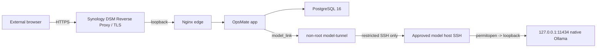

# OpsMate Local 공개 데모 운영 Runbook

## 문서 상태

- 운영 자산: `implemented`
- 실제 모델 adapter E2E: `verified` (`2026-08-23`, `gemma3:12b`, 9/9, 관측 p95 21,076ms <= 30,000ms)
- Synology + restricted SSH tunnel internal E2E: `verified` (`2026-08-25`)
- internal normal close / same-digest reopen / emergency close: `verified`
- public DSM ingress / Internet 외부 smoke: 아직 `unverified`
- 기본 운영 상태: `CLOSED`
- 상세 내부 증거: [`NAS_INTERNAL_E2E_EVIDENCE.md`](NAS_INTERNAL_E2E_EVIDENCE.md)

이 문서는 **개인 Synology NAS의 공개 앱**과 **승인된 GPU host의 native Ollama**를 restricted SSH tunnel로 연결하는 운영 경계를 정의합니다. 공개 문서에는 credential, 실제 host/IP/user, SSH key, known_hosts 원문과 승인 문서 원문을 기록하지 않습니다.

## 현재 구조



## 보안 경계

`2026-08-25` internal verifier에서 다음 경계를 실제 확인했습니다.

- OpsMate Nginx edge는 NAS loopback `127.0.0.1:18083`에만 bind
- PostgreSQL, app, model-tunnel host port 없음
- app/edge direct egress 차단
- `model-tunnel`만 승인된 SSH path 사용
- exact host-key pin + public-key-only + destination restriction
- `/actuator/**` edge 차단
- Secure XSRF/JSESSIONID session
- cross-workspace isolation
- Nginx rate-limit `429`
- credential/log scan PASS

공개 Internet ingress는 아직 별도 gate입니다.

## 검증 release

```text
source=f99686981da7efb8802635ae2bde5b0f781433ad
app=ghcr.io/son1004007/opsmate-local@sha256:61e267c05bf0ce0ea932ae62a3989194bd2a0065532d0ee4caee8b37c8f9d40b
tunnel=ghcr.io/son1004007/opsmate-model-tunnel@sha256:7fc133485a8ba60190e55b5eeb2da8b5eb02c1aa7e70e0cc0ce7b723746db1df
model=gemma3:12b
```

이미지는 workflow에서 publish 후 immutable pull verification을 통과했고 Synology에도 exact digest로 pull/stage 됐습니다.

## NAS runtime 준비 증거

`2026-08-25` bounded preparation에서 다음을 확인했습니다.

- exact source/image digest: PASS
- runtime `.env` permission: `600`
- PostgreSQL persistent volume: present
- 직전 승인 release에서 DB credential continuity 유지
- preparation 종료 후 running container: `0`
- final state: `CLOSED`

실제 secret 값은 Git/Issue/PR/workflow log에 기록하지 않습니다.

## 내부 전체 E2E 증거

같은 날 Synology에서 다음을 연속 검증했습니다.

1. exact release OPEN
2. model tunnel health
3. DB migration/readiness
4. loopback edge readiness
5. port/network/security gate
6. Secure session과 실제 모델 기반 draft
7. persona flow와 cross-workspace isolation
8. rate-limit / credential-log scan
9. normal close와 synthetic workspace purge
10. strict CLOSED verification
11. same immutable digest reopen
12. emergency close rehearsal
13. final normal close
14. final `CLOSED`

최종 marker는 `runtime_policy_flags=YES_YES`, `runtime_final_state=CLOSED`, internal verifier PASS였습니다.

## DSM Reverse Proxy/TLS — 현재 남은 사용자 설정

OpsMate Compose `edge`는 이미 NAS loopback에만 bind합니다. DSM Reverse Proxy는 공개 HTTPS source를 받고 destination을 이 loopback HTTP endpoint로 전달해야 합니다.

현재 후보:

```text
Source protocol: HTTPS
Source hostname: <Synology DDNS hostname>
Source port: 58889
Destination protocol: HTTP
Destination hostname: 127.0.0.1
Destination port: 18083
```

조건:

- source hostname과 일치하는 DSM 인증서 사용
- router에서 외부 TCP `58889`를 NAS의 TCP `58889`로 전달
- `18083`을 router에서 직접 expose하지 않음
- DB/model/app container port를 router에서 expose하지 않음

`58889`는 실제 설정과 외부 smoke가 끝나기 전까지 검증된 public port로 표시하지 않습니다.

## 서비스 열기

DSM/router ingress와 NAS-local secret이 준비된 뒤 reviewed automation이 `deploy/open-demo.sh`와 동등한 bounded path를 실행합니다.

`open-demo.sh` 핵심 순서:

1. app/tunnel image full digest 확인
2. DB role/credential boundary 확인
3. SSH key/known_hosts 존재와 target 형식 확인
4. model URL/allowlist 확인
5. egress/rate verification flag 확인
6. loopback edge port 충돌 확인
7. immutable image pull/inspect
8. restricted model-tunnel + Ollama health
9. PostgreSQL
10. one-shot Flyway migration
11. runtime app
12. loopback Nginx edge
13. public HTTPS smoke

중간 실패 시 공개 edge와 쓰기 주체를 우선 닫고 안전하게 `CLOSED`로 복귀해야 합니다.

## 공개 smoke 기준

실제 public HTTPS origin에서 다음을 검증합니다.

- root 응답과 `X-OpsMate-Demo: live` marker
- 공개 `/api/**` 거부와 Basic challenge 부재
- 공개 `/actuator/**` 차단
- XSRF/JSESSIONID의 보안 속성
- 합성 workspace 생성
- 실제 모델 기반 서버 검증 draft
- submit -> approve -> order
- AUDITOR `ORDER_CREATED`
- smoke workspace cleanup
- 서로 다른 두 외부 session cross-workspace isolation
- 외부 PostgreSQL/model port 비노출
- public rate-limit `429`
- LTE/5G 외부 접근

이 smoke가 성공하지 않으면 public open은 완료된 것이 아닙니다.

## 정상 닫기

`deploy/close-demo.sh`는 다음 순서와 gate를 사용합니다.

1. loopback Nginx edge 중단
2. app graceful stop
3. model-tunnel 중단 및 tunnel secret material 제거
4. 중단 상태 확인
5. PostgreSQL 유지/기동 후 synthetic `demo_workspaces` purge
6. remaining workspace `0` 확인
7. migrate/DB 중단
8. Synology Container Manager의 DB stopped-state bounded convergence 확인
9. Compose가 purge 과정에서 재생성할 수 있는 ephemeral tunnel-secret volume 최종 제거
10. `verify-closed.sh`

이 normal close는 Synology internal E2E에서 실제 PASS했습니다. PostgreSQL persistent volume은 보존합니다.

## 긴급 닫기

`deploy/emergency-close.sh`는 env/credential 없이 Compose label을 기준으로 해당 OpsMate project의 edge -> app -> model-tunnel -> migrate -> DB를 닫습니다. 다른 NAS workload나 공유 native Ollama daemon을 중단하지 않습니다.

내부 emergency-close rehearsal은 PASS했습니다. 긴급 닫기 자체는 DB credential을 사용하지 않으므로 synthetic purge가 필요하면 환경 복구 뒤 normal close를 수행합니다.

## 동일 artifact reopen

- 동일 source와 동일 app/tunnel image digest를 사용합니다.
- tunnel health, migration/readiness, session/model flow를 다시 통과해야 합니다.
- 내부 same-digest reopen은 `2026-08-25` PASS했습니다.
- public ingress 구성 후에는 public HTTPS smoke까지 재통과해야 public same-artifact reopen으로 인정합니다.
- rehearsal 종료 후 최종 상태는 다시 `CLOSED`로 둡니다.

## 장애 대응

### 모델 또는 SSH tunnel 장애

- draft 생성은 fail-closed로 유지합니다.
- 유료 API나 다른 모델로 자동 fallback하지 않습니다.
- edge/app/tunnel을 닫고 model runtime과 SSH 경계를 별도로 진단합니다.
- 복구 뒤 tunnel health + 실제 모델 path + public smoke 전에는 reopen하지 않습니다.

### workspace 간 데이터 노출

- 즉시 emergency close합니다.
- 합성 workspace를 정리합니다.
- repository query/service guard와 cross-workspace 회귀 테스트를 추가합니다.
- 전체 regression 전에는 reopen하지 않습니다.

### SSH key 또는 credential 노출

- edge와 tunnel을 즉시 닫습니다.
- restricted key를 회수·재발급합니다.
- NAS-local secret을 교체합니다.
- Git history/image layer/log 노출 범위를 확인합니다.

## 검증 기록 양식

공개 기록에는 다음만 남깁니다.

```text
검증 시각/timezone:
source commit:
application image digest:
tunnel image digest:
DB migration version:
공개 가능한 model ID:
repository regression: PASS / FAIL / NOT RUN
NAS -> restricted tunnel -> model: PASS / FAIL / NOT RUN
internal network/security: PASS / FAIL / NOT RUN
internal normal close: PASS / FAIL / NOT RUN
internal emergency close: PASS / FAIL / NOT RUN
internal same-digest reopen: PASS / FAIL / NOT RUN
public HTTPS smoke: PASS / FAIL / NOT RUN
external DB/model non-exposure: PASS / FAIL / NOT RUN
public rate limit: PASS / FAIL / NOT RUN
public lifecycle: PASS / FAIL / NOT RUN
final state: OPEN / CLOSED / UNKNOWN
known limitations:
```

실제 host/IP/user, SSH key, known_hosts 원문과 조직 승인 문서 원문은 공개 기록에서 제외합니다.

## 완료 기준

현재 **내부 release/runtime/lifecycle gate는 완료**됐습니다. OpsMate public deployment 완료에는 추가로 다음이 필요합니다.

- DSM Reverse Proxy/TLS + router public ingress
- Internet/LTE public HTTPS 전체 persona smoke
- external PostgreSQL/model non-exposure
- public session/rate/security boundary
- public-origin normal close / same-digest reopen / emergency close
- 마지막 normal close와 최종 `CLOSED`
- README/evidence/state 문서 최종 동기화
