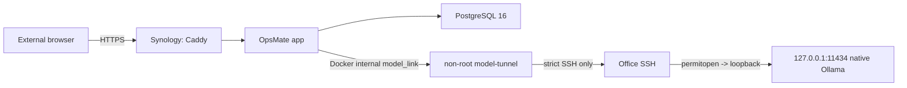

# OpsMate Local 공개 데모 운영 Runbook

## 문서 상태

- 운영 자산: `implemented`, 현재 PR에서 SSH tunnel 구조로 전환 중
- 실제 모델 adapter E2E: `verified` (`2026-08-23`, `gemma3:12b`, 9/9, 관측 p95 21,076ms <= 30,000ms)
- public URL / 외부 smoke / 실제 close-reopen: 아직 `unverified`
- 기본 운영 상태: `CLOSED`

이 문서는 **개인 Synology NAS의 공개 앱**과 **조직 승인된 Office GPU 서버의 native Ollama**를 연결하는 현재 배포 경계를 정의합니다. 과거의 Office Docker/NVIDIA Compose model-host 설계는 현재 Office runtime에 Docker가 없다는 실측 결과와 맞지 않으므로 사용하지 않습니다.

공개 문서에는 credential, 실제 host/IP, SSH 계정, known_hosts 원문, 승인 문서 원문을 기록하지 않습니다.

## 현재 구조



### 보안 경계

- 공개되는 것은 Synology의 OpsMate HTTPS edge뿐입니다.
- PostgreSQL은 Docker internal network에만 존재하며 host port를 publish하지 않습니다.
- OpsMate app은 일반 인터넷 egress network에 연결하지 않습니다.
- `model-tunnel`만 외부 egress network에 연결됩니다.
- `model-tunnel`은 Office SSH host key를 `StrictHostKeyChecking=yes`로 검증합니다.
- Office의 전용 SSH public key는 `permitopen="127.0.0.1:11434"`, no-pty/no-agent-forwarding/no-X11-forwarding 같은 제한을 적용하는 것이 필수 gate입니다.
- Ollama는 Office loopback에서 그대로 동작하며 공인망에 `11434`를 열지 않습니다.
- SSH tunnel의 `11434`도 Synology host에 publish하지 않고 Docker-internal `model_link`에서만 앱이 접근합니다.

## 현재 runtime evidence

`2026-08-23` read-only probe 기준:

- Synology: Docker `24.0.2`, `x86_64`, 기존 서비스가 동작 중이며 OpsMate는 별도 Compose project로 추가합니다.
- Office: Ollama `0.13.5`, `gemma3:12b` 존재, loopback API 응답 확인.
- Office: Docker 없음. 따라서 Office에 Docker를 새로 설치하는 것을 OpsMate 전제조건으로 삼지 않습니다.
- 실제 모델 adapter E2E는 `gemma3:12b`로 이미 통과했지만, NAS -> SSH tunnel -> Office Ollama -> NAS 앱 전체 경로는 별도 검증해야 합니다.

## 배포 입력값

실제 값은 NAS-local `deploy/.env`와 NAS-local secret files에만 둡니다.

필수 범주:

- `OPSMATE_APP_IMAGE`: 검증된 app image full digest
- `OPSMATE_TUNNEL_IMAGE`: 검증된 tunnel image full digest
- `DEMO_DOMAIN`, ACME email
- PostgreSQL admin / migration / runtime 역할과 서로 다른 비밀번호
- Office SSH endpoint metadata
- Office 전용 tunnel private key 파일
- 검증된 Office SSH known_hosts 파일
- `OPSMATE_LLM_BASE_URL=http://model-tunnel:11434`
- `OPSMATE_LLM_ALLOWED_HOSTS=model-tunnel`
- `OPSMATE_LLM_MODEL=gemma3:12b`

SSH tunnel 방식에서는 별도 model API Bearer token을 사용하지 않습니다. 인증과 목적지 제한은 SSH key + host-key 검증 + Office `authorized_keys`의 `permitopen` 경계에서 수행합니다.

`.env`, private key와 real known_hosts는 Git, Issue, PR, workflow log에 저장하지 않습니다.

## 이미지 발행

`Publish OpsMate Images` workflow는 `main`의 관련 소스가 바뀌면 다음 linux/amd64 이미지를 GHCR에 발행하도록 구성합니다.

- `ghcr.io/son1004007/opsmate-local:<source-sha>`
- `ghcr.io/son1004007/opsmate-model-tunnel:<source-sha>`

실제 배포에는 tag만 사용하지 않고 workflow가 기록한 `@sha256:<digest>` full reference를 사용합니다. reopen은 같은 app/tunnel digest를 재사용해야 same-artifact rehearsal로 인정합니다.

## 공개 전 필수 gate

### Office model path

- [x] 외부 개인 포트폴리오 추론 용도에 대한 조직 승인 확인
- [x] native Ollama와 `gemma3:12b` runtime 확인
- [x] 실제 모델 adapter E2E 성공
- [ ] OpsMate 전용 SSH key 생성 및 NAS secret 배치
- [ ] Office `authorized_keys`에 destination-restricted key 등록
- [ ] exact Office host key를 NAS known_hosts secret으로 배치
- [ ] NAS `model-tunnel` health가 Office loopback Ollama까지 성공
- [ ] Office `11434`가 인터넷에 노출되지 않음을 외부에서 확인

### Synology app path

- [x] Docker와 x86_64 runtime 확인
- [ ] app/tunnel GHCR image full digest 확보
- [ ] 기존 NAS workloads와 port 충돌 없음 확인
- [ ] public hostname/TLS 방식 확정
- [ ] DB 역할 분리와 NAS-local secret 구성
- [ ] app이 일반 egress network에 연결되지 않는 Compose 증거 확인
- [ ] public edge rate limit 적용 증거 확인
- [ ] 공개 전 `verify-closed.sh` 성공

`OPSMATE_HOST_EGRESS_POLICY_VERIFIED=YES`와 `OPSMATE_EDGE_RATE_LIMIT_VERIFIED=YES`는 실제 검증 증거가 있을 때만 설정합니다. 단순 flag 변경은 검증을 대신하지 않습니다.

## 서비스 열기

NAS에서 실행합니다.

```sh
./deploy/open-demo.sh
```

`open-demo.sh`의 순서:

1. app/tunnel image가 full digest인지 확인합니다.
2. DB 역할 분리와 비밀번호 기준을 확인합니다.
3. Office SSH target 형식과 NAS-local key/known_hosts 파일 존재를 확인합니다.
4. model URL이 정확히 `http://model-tunnel:11434`인지 확인합니다.
5. tunnel-only egress와 edge rate-limit 검증 flag를 확인합니다.
6. immutable app/tunnel image를 pull/inspect합니다.
7. 기존 public Caddy를 닫습니다.
8. `model-tunnel`을 시작하고 Ollama `/api/version` health를 기다립니다.
9. PostgreSQL을 시작합니다.
10. 같은 app image의 one-shot Flyway migration을 실행합니다.
11. migration credential이 없는 runtime app을 시작합니다.
12. Caddy를 시작합니다.
13. 실제 HTTPS smoke를 수행합니다.

중간 실패 시 Caddy -> app -> model-tunnel 순으로 닫고, 쓰기 주체가 중단된 것이 확인될 때만 합성 workspace 삭제를 시도한 뒤 DB를 닫습니다.

## 공개 smoke 기준

`deploy/smoke-test.sh`는 실제 HTTPS를 통해 다음을 확인합니다.

- live marker
- HTTP -> HTTPS redirect
- 공개 `/api/**` 차단과 Basic challenge 부재
- session/XSRF cookie 보안 속성
- 새 합성 workspace 생성
- 실제 모델을 사용한 draft 생성
- submit -> decision -> order 흐름
- audit event 확인
- smoke workspace 삭제

추가 외부 검수:

- 서로 다른 두 세션의 cross-workspace 격리
- 외부 PostgreSQL port 비노출
- 외부 Ollama/model port 비노출
- LTE/5G에서 실제 UX 확인

## 정상 닫기

```sh
./deploy/close-demo.sh
```

순서:

1. Caddy 중단
2. app graceful stop
3. model-tunnel 중단
4. 세 서비스가 실제 중단됐는지 확인
5. DB를 일시 유지/기동해 합성 `demo_workspaces`를 `TRUNCATE ... CASCADE`
6. 남은 workspace `0` 확인
7. migrate/DB 중단
8. `verify-closed.sh`로 edge/app/tunnel/DB 중단 + PostgreSQL volume 보존 확인

Office의 native Ollama 자체는 다른 개발 업무와 공유될 수 있으므로 OpsMate close가 Ollama daemon을 임의로 종료하지 않습니다. OpsMate용 접근 경계는 tunnel 종료와 restricted SSH key로 닫습니다.

## 긴급 닫기

환경 파일이나 credential을 읽을 수 없어도 다음을 실행할 수 있습니다.

```sh
./deploy/emergency-close.sh opsmate-demo
```

Compose label을 기준으로 **해당 OpsMate project의** Caddy -> app -> model-tunnel -> migrate -> DB만 중단합니다. 다른 NAS container나 Office Ollama를 건드리지 않습니다.

긴급 닫기는 DB credential이 없으므로 합성 데이터 삭제를 수행하지 않습니다. 환경을 복구한 뒤 정상 close를 수행해 purge까지 확인해야 reopen할 수 있습니다.

## 동일 artifact reopen

1. Office 사용 승인이 여전히 유효한지 확인합니다.
2. Office native Ollama 버전/모델 ID가 이전 검증 경계와 호환되는지 확인합니다.
3. 이전과 동일한 `OPSMATE_APP_IMAGE@sha256`과 `OPSMATE_TUNNEL_IMAGE@sha256`를 사용합니다.
4. emergency close 이력이 있다면 정상 close로 합성 데이터 삭제를 먼저 확인합니다.
5. `open-demo.sh` 전체 preflight/tunnel health/migration/readiness/HTTPS smoke를 다시 통과합니다.
6. 외부 DB/model 비노출을 재확인합니다.
7. rehearsal 종료 후 최종 상태는 다시 `CLOSED`로 둡니다.

소스, image digest, model ID, migration 또는 주요 runtime이 바뀌면 same-artifact reopen이 아니므로 새 release 검증이 필요합니다.

## 장애 대응

### 모델 또는 SSH tunnel 장애

- draft 생성은 fail-closed로 유지합니다.
- 유료 API나 다른 모델로 자동 fallback하지 않습니다.
- public edge/app을 닫고 tunnel 상태와 Office Ollama 상태를 별도로 진단합니다.
- 복구 뒤 tunnel health + 실제 모델 E2E + public smoke 전에는 reopen하지 않습니다.

### workspace 간 데이터 노출

- 즉시 emergency close합니다.
- 모든 합성 workspace를 정리합니다.
- repository query/service guard와 cross-workspace 회귀 테스트를 추가합니다.
- 전체 regression 전에는 reopen하지 않습니다.

### SSH key 또는 credential 노출

- public edge와 tunnel을 즉시 닫습니다.
- Office restricted key를 `authorized_keys`에서 회수하고 새 key를 발급합니다.
- NAS-local secret을 교체합니다.
- Git history/image layer/log 노출 범위를 확인합니다.

## 검증 기록

공개 기록에는 다음만 남깁니다.

```text
검증 시각/timezone:
source commit:
application image digest:
tunnel image digest:
DB migration version:
공개 가능한 모델 식별자:
clean verify: PASS / FAIL / NOT RUN
NAS -> SSH tunnel -> Ollama health: PASS / FAIL / NOT RUN
public HTTPS smoke: PASS / FAIL / NOT RUN
cross-workspace isolation: PASS / FAIL / NOT RUN
external DB/model non-exposure: PASS / FAIL / NOT RUN
edge rate limit: PASS / FAIL / NOT RUN
normal close: PASS / FAIL / NOT RUN
emergency close: PASS / FAIL / NOT RUN
same-digest reopen: PASS / FAIL / NOT RUN
synthetic workspace purge: PASS / FAIL / NOT RUN
known limitations:
```

실제 host/IP/user, SSH key, known_hosts 원문과 조직 승인 문서 원문은 공개 기록에서 제외합니다.

## 완료 기준

다음 항목이 모두 검증돼야 OpsMate public deployment를 완료로 표시합니다.

- 최신 Maven regression과 container/config CI 성공
- immutable app/tunnel image digest 발행 및 pull 성공
- destination-restricted SSH tunnel의 실제 NAS -> Office E2E 성공
- public HTTPS 전체 persona smoke 성공
- PostgreSQL과 Ollama 외부 비노출 확인
- edge rate-limit과 tunnel-only model egress 확인
- normal/emergency close 성공
- 동일 app/tunnel digest reopen 성공
- close 후 합성 workspace 삭제와 최종 `CLOSED` 확인
- README/evidence/state 문서가 실제 결과와 일치
