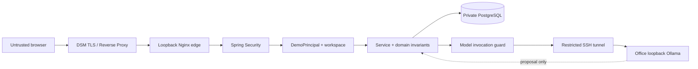

# OpsMate Local 공개 데모 위협 모델

## 문서 상태와 범위

- 상태: `implemented`, `tested-component`; 외부 배포 통제는 별도 gate
- 대상: Spring MVC + Thymeleaf + HttpSession 공개 데모, PostgreSQL, Synology DSM/Nginx ingress, restricted SSH model tunnel, Office native Ollama
- 보호 목표: 공개 방문자 격리, 결정적 업무 통제, credential 비공개, 모델·DB 비노출, 장애 시 fail-closed

문서나 스크립트가 존재한다는 사실만으로 실제 외부 통제가 적용됐다고 판단하지 않습니다. runtime/외부 검증을 통과한 항목만 `verified`로 올립니다.

## 보호할 자산

1. 업무 상태 무결성: 승인되지 않은 상태 전이·발주·중복 발주 방지
2. demo workspace 격리: 방문자별 요청·발주·감사 이벤트
3. 인증/운영 비밀: session ID, DB credential, NAS-local SSH private key, known_hosts
4. 모델 자원: 승인된 Office GPU/Ollama와 접근 경계
5. 가용성: 제한된 GPU, DB, app 자원
6. 공개 증거 신뢰성: 구현·테스트·runtime 상태와 문서 표현 일치

공개 데모에는 실제 조직/고객 데이터, 내부 정책, 운영 계정이나 사설 URL을 저장하지 않습니다.

## 신뢰 경계



모든 HTTP header와 forwarded header, URL UUID, 자연어 입력, idempotency key, persona 요청과 모델 JSON은 신뢰하지 않는 입력입니다. 모델이 사설 서버에 있어도 업무 권한은 부여하지 않습니다.

## 핵심 보안 가정

- 공개 demo는 Spring app 한 인스턴스로 운영합니다.
- 전체 모델 동시 실행은 `1`입니다.
- Office 모델 사용은 승인된 용도에서만 수행합니다.
- DSM만 public ingress를 담당하며 OpsMate edge는 NAS loopback에만 bind합니다.
- DB와 model endpoint는 인터넷에서 직접 접근할 수 없습니다.
- app은 일반 egress network가 없고 model-tunnel만 Office SSH로 나갑니다.
- 입력 데이터는 합성 예시이며 TTL/종료 시 삭제합니다.

이 가정이 깨지면 관련 통제를 재검토합니다. 특히 다중 app 인스턴스에서는 in-memory single-flight/quota/semaphore를 분산 제어로 바꿔야 합니다.

## 위협과 통제

| 위협 | 영향 | 설계 통제 | 필수 검증 |
|---|---|---|---|
| prompt injection | 모델이 업무 권한이 있는 것처럼 행동 | 모델에 DB·도구·임의 URL 권한 없음, 서버가 정책 근거를 먼저 조회 | 공격 문자열에서도 업무 쓰기는 서버 명령으로만 발생 |
| fabricated policy ID | 허위 근거 초안 | 서버가 조회한 policy ID 부분집합인지 재검증 | unknown ID에서 DB 쓰기 0건 |
| malformed/oversized model JSON | 잘못된 명령 해석·메모리 소진 | 엄격 schema, unknown field 거부, token/byte 상한 | 깨진·추가·과대 응답 fail-closed |
| 모델 timeout/장애 | 지연·불완전 저장 | timeout, bounded queue, fallback 없음, 저장 전 실패 | timeout/5xx/연결 불가 DB 쓰기 0건 |
| SSRF/model endpoint 조작 | 내부망 탐색·외부 API 호출 | 고정 base URL, host allowlist, 고정 `/api/chat` | 비허용 host/path/query 설정에서 시작 실패 |
| app 직접 인터넷 egress | allowlist 우회 | app은 internal networks만 사용, `tunnel_egress` 미연결 | rendered Compose/실제 runtime network 확인 |
| SSH tunnel credential 탈취 | Office 계정 악용 | 전용 NAS-local key, exact host key, command denial, destination-restricted forwarding | private key 비공개, remote command 실패, Ollama forward만 성공 |
| SSH MITM/TOFU | 잘못된 Office host로 연결 | 기존 검증 trust store에서 exact host key 복사, `StrictHostKeyChecking=yes` | host key mismatch 시 연결 실패 |
| 임의 SSH forwarding | Office 내부망 접근 | Office authorized key `permitopen="127.0.0.1:11434"` | authorized key 옵션과 실제 tunnel E2E 검증 |
| 모델 port 인터넷 노출 | 무단 GPU 사용 | Ollama loopback 유지, tunnel port는 Docker internal only | 외부 11434 연결 실패 |
| DB port 노출·과도 권한 | 데이터/schema 변조 | host port 없음, admin/migration/runtime 역할 분리 | Testcontainers 권한 + 외부 DB 연결 실패 |
| 세션 탈취 | 다른 workspace 접근 | TLS, Secure/HttpOnly/SameSite cookie, timeout | public HTTPS cookie 검증 |
| session fixation | 공격자 session 재사용 | demo 시작 시 session ID 회전 | start 전후 session ID 비교 |
| CSRF | 방문자 권한으로 상태 변경 | demo web chain CSRF 활성 | token 없는 쓰기 거부 |
| 공개 Basic API | UI 우회 | demo profile에서 `/api/**` deny, Basic challenge 없음 | public API가 403, challenge 없음 |
| workspace IDOR | 다른 방문자 데이터 노출 | DemoPrincipal workspace + repository 조건 + service 재검증 | 두 외부 session 교차 UUID/목록 노출 0건 |
| persona 위조 | 권한 상승 | enum allowlist, endpoint/service RBAC | 잘못된 persona/역할 동작 거부 |
| idempotency 재사용 | 기존 결과 덮기 | workspace·actor·key + fingerprint, DB unique | same input 재사용, different input conflict |
| 동일 key 동시 요청 | 모델 중복 호출 | single-flight | 모델 1회·저장 1회 |
| 모델 폭주 | GPU OOM/DoS | workspace/global quota, concurrency 1, bounded queue/follower | 초과 요청 busy/rate 오류 |
| 익명 session 폭주 | DB/session 고갈 | start 전 admission limit, active workspace cap | 거부 요청 session/workspace 미생성 |
| HTTP 폭주 | app/DB/GPU 가용성 저하 | loopback Nginx global rate limit + app/model quota | public 반복 요청에서 `429` 확인 |
| forwarded-header 위조 | scheme/origin 정책 우회 | origin을 loopback으로 제한하고 DSM→Nginx 경계만 public | origin 직접 접근 불가, 임의 header로 우회 불가 |
| credential 커밋/로그 | DB/SSH 탈취 | NAS-local secret, `.env` ignore, bounded logs, public docs에서 값 제외 | Git/image/log secret scan |
| 공급망 drift | 검증하지 않은 code/image | GHCR full digest, pinned base images, CI build | NAS에서 exact digest pull/inspect |
| close 뒤 서비스 잔존 | 비의도 공개 | normal/emergency close + local/public live-marker verifier | edge/app/tunnel/DB stopped, marker 부재 |
| reopen drift | 다른 artifact 실행 | same app/tunnel digest + migration/smoke gate | same-digest reopen E2E |
| 승인 철회 | 조직 자원 오사용 | 승인 gate, tunnel credential 회수 가능 | 철회 시 edge/tunnel 중단과 Office key 제거 |

## restricted SSH key 경계

OpsMate tunnel private key는 Synology에서 생성하고 NAS 밖으로 내보내지 않습니다. GitHub Actions의 `DEVICE_SSH_PRIVATE_KEY`를 애플리케이션 credential로 재사용하지 않습니다.

Office `authorized_keys`의 OpsMate 전용 entry는 다음 의미를 가져야 합니다.

```text
restrict
port-forwarding
permitopen="127.0.0.1:11434"
command="/bin/false"
```

따라서 검증 기준은 둘 다 필요합니다.

1. 해당 키로 remote shell/command가 성공하지 않는다.
2. 해당 키로 Office loopback Ollama forwarding과 `/api/version` health는 성공한다.

하나만 확인해서는 restricted tunnel을 `verified`로 기록하지 않습니다.

## workspace 격리 규칙

1. `DemoPrincipal`에서 현재 workspace를 얻습니다.
2. repository query에 workspace를 필수 조건으로 넣습니다.
3. service/read policy가 조회 결과의 workspace를 다시 확인합니다.
4. 그 뒤 역할, 소유권과 상태를 검사합니다.
5. order/audit 생성에도 같은 workspace를 서버가 주입합니다.
6. DB unique/FK 제약에도 workspace를 포함합니다.

브라우저가 전달한 workspace ID는 권한 판단의 source of truth가 아닙니다.

## PostgreSQL 역할 경계

- admin: 초기 역할 준비와 정상 close purge
- migration: one-shot Flyway/schema 소유
- runtime: 필요한 DML/sequence만

장기 실행 app에는 migration credential을 주지 않습니다. runtime DDL과 Flyway history 접근 거부는 Testcontainers 경로에서 검증합니다.

## edge와 public ingress 경계

Synology의 80/443은 DSM이 사용합니다. OpsMate Nginx가 이를 직접 bind하지 않습니다.

```text
Internet HTTPS
-> DSM source hostname/port + certificate
-> http://127.0.0.1:<OpsMate edge port>
-> Nginx rate/security boundary
-> Spring app internal network
```

현재 `58889`는 public HTTPS 후보 port이고 `18083`은 loopback edge 후보입니다. 실제 DSM/router 설정과 충돌 검증 전에는 확정된 public endpoint로 기록하지 않습니다.

## 공급망과 이미지

- app/tunnel: GitHub Actions에서 linux/amd64 GHCR image 발행
- 실제 deployment: mutable tag 대신 full `@sha256:<digest>` 사용
- app/tunnel runtime: non-root
- root filesystem: read-only
- capabilities: dropped
- `no-new-privileges`: enabled
- DB/Nginx base images: digest pinned

NAS에서 실제 digest pull/inspect가 성공하기 전에는 release artifact gate가 완료된 것이 아닙니다.

## lifecycle 위협 통제

### normal close

```text
Nginx edge
-> app graceful stop
-> model-tunnel
-> synthetic workspace purge
-> DB stop
-> local/public marker verification
```

### emergency close

환경 파일 없이 Compose label로 OpsMate project의 edge/app/model-tunnel/migrate/DB만 중단합니다. 다른 NAS workload와 Office native Ollama를 중단하지 않습니다. credential이 없으므로 synthetic purge는 이후 정상 close에서 완료합니다.

### reopen

같은 app/tunnel digest를 사용하고 tunnel health, migration/readiness, public smoke와 외부 DB/model 비노출을 다시 확인합니다.

## 현재 검증 상태

- `2026-08-04`: 전체 clean verify 54개 성공
- `2026-08-23`: 실제 `gemma3:12b` E2E 9/9, p95 21,076ms
- Synology Docker/x86_64와 DSM 80/443: runtime 확인
- Office native Ollama/model: runtime 확인
- Compose/Nginx/tunnel 설계: 자동화 검증 경로 존재
- NAS→restricted SSH tunnel→Office Ollama: runtime E2E 미검증
- DSM public ingress/public smoke/rate-limit 외부 동작: 미검증
- external DB/model non-exposure: 미검증
- normal/emergency close + same-digest reopen: 미검증

미검증 항목을 운영 완료로 과장하지 않습니다.
