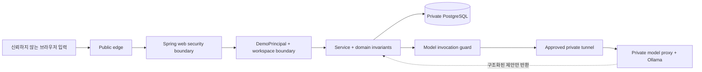

# OpsMate Local 공개 데모 위협 모델

## 문서 상태와 범위

- 상태: `implemented`, `tested-component`; 외부 배포 통제는 별도 gate
- 대상: Spring MVC + Thymeleaf + HttpSession 공개 데모, PostgreSQL, 승인된 사설 GPU 모델 연결
- 보호 목표: 공개 방문자 격리, 결정적 업무 통제, credential 비공개, 모델·DB 비노출, 모델 의존 초안 경로의 장애 시 fail-closed

이 문서는 공개 데모의 위협, 구현된 통제와 아직 외부 환경에서 검증해야 할 gate를 구분합니다. `2026-08-04` 전체 `clean verify`에서 54개 테스트가 성공했고 실패·오류·건너뜀은 0개였습니다. 문서나 스크립트가 존재한다는 사실만으로 실제 배포 통제가 적용됐다고 판단하지 않습니다.

## 보호할 자산

1. 업무 상태의 무결성
   - `DRAFT`, `PENDING_APPROVAL`, `APPROVED`, `REJECTED`, `ORDERED` 전이
   - 승인되지 않은 발주와 중복 발주 방지
2. demo workspace 격리
   - 방문자별 구매 요청, 발주, 감사 이벤트
3. 인증과 운영 비밀
   - 세션 식별자, DB credential, model proxy token, tunnel credential
4. 승인된 사설 GPU 모델 호스트와 네트워크
   - 승인된 계산 자원, 내부 경로와 연결 정보
5. 서비스 가용성과 비용
   - 제한된 GPU 메모리, 모델 처리 시간, DB와 애플리케이션 자원
6. 공개 증거의 신뢰성
   - 실제 구현·테스트·배포 상태와 문서 표현의 일치

공개 데모에는 실제 조직 데이터, 고객 데이터, 내부 정책, 사설 URL과 운영 계정을 저장하지 않습니다.

## 신뢰 경계

### 신뢰하지 않는 입력

- 자연어 구매 요청과 반려 사유
- URL path의 UUID
- persona 전환 요청
- idempotency key
- 모든 HTTP header와 proxy 전달 header
- 모델이 생성한 JSON과 정책 ID

### 제한적으로 신뢰하는 구성요소

- edge가 전달한 요청은 TLS가 적용됐더라도 사용자 입력으로 취급합니다.
- HttpSession은 서버가 생성한 값만 신뢰하고 브라우저가 전달한 actor/workspace는 사용하지 않습니다.
- 모델은 사설 서버에 있더라도 업무 권한을 부여하지 않습니다.
- DB 고유 제약과 transaction은 애플리케이션 사전 조회보다 강한 최종 불변식입니다.

## 보안 가정

- 공개 데모는 Spring 애플리케이션 한 인스턴스로 운영합니다.
- 모델 동시 실행은 전체 한 건으로 제한합니다.
- 사설 GPU 모델 호스트는 명시적으로 승인된 기간과 용도에서만 사용합니다.
- 모델과 DB는 인터넷에서 직접 접근할 수 없습니다.
- demo persona 전환은 체험 기능이며 실제 조직 IAM을 증명하지 않습니다.
- 입력 데이터는 합성 예시를 전제로 하며 만료 뒤 삭제합니다.

가정이 깨지면 관련 통제의 유효성도 다시 검토해야 합니다. 특히 애플리케이션을 여러 인스턴스로 늘리면 in-memory single-flight, rate limit과 semaphore는 충분하지 않습니다.

## 위협과 통제

| 위협 | 영향 | 설계 통제 | 필수 검증 |
|---|---|---|---|
| 공개 입력의 prompt injection | 모델이 승인, DB 접근 또는 외부 호출을 주장 | 모델에 도구·DB·임의 URL 권한을 주지 않고 서버가 조회한 합성 정책만 전달 | 공격 문자열에서도 모델 출력이 제안에 머물고 업무 쓰기는 서버 명령으로만 발생 |
| 모델의 fabricated policy ID | 허위 근거로 초안 생성 | 조회한 policy ID 부분집합인지 서버에서 다시 검증 | 존재하지 않는 ID, 다른 분류와 초과 금액을 모두 거부하고 해당 초안 DB 쓰기 0건 |
| malformed·unknown-field·과대 JSON | 예기치 않은 필드가 업무 명령처럼 해석되거나 heap 소진 | 엄격한 schema, unknown field 거부, 출력 token·응답 byte 상한과 구조 검증 후 entity 생성 | 빈·깨진·누락·추가·과대 응답에서 fail-closed |
| 모델 서버 장애·timeout | 요청 지연, 불완전 초안 저장 | timeout, 제한된 queue, fallback 없음, 초안 저장 전 실패 | timeout·5xx·연결 불가에서 `MODEL_UNAVAILABLE`과 해당 초안 DB 쓰기 0건 |
| 모델 endpoint 조작과 SSRF | 내부망 탐색 또는 외부 유료 API 호출 | 고정 base URL, host allowlist, 고정 `/api/chat`, 요청에서 URL을 받지 않음 | 비허용 host/path/query/userinfo 설정 시 시작 실패 |
| 모델 포트의 인터넷 노출 | 무단 GPU 사용과 내부 서비스 공격 | loopback/private bind, tunnel, host firewall, model proxy 인증 | 외부 네트워크에서 Ollama 포트 연결 실패 |
| DB 포트·과도한 권한 | 합성 데이터 변조, schema 변경, migration credential 탈취 | host port 없음, admin·one-shot migration·runtime 역할 분리, runtime DDL·Flyway history 거부 | Testcontainers 역할 검증과 외부 네트워크 DB 연결 실패 |
| 세션 탈취 | 다른 방문자의 workspace 접근 | TLS, Secure·HttpOnly·SameSite=Lax cookie, 짧은 timeout, 로그에서 session ID 제외 | HTTP 접근 차단, cookie 속성 확인, 세션 ID가 응답 본문·로그에 없음 |
| session fixation | 공격자가 정한 세션 재사용 | 데모 시작 시 새 세션 ID 발급·회전 | 기존 세션 ID가 start 이후 유지되지 않음 |
| CSRF | 방문자 세션으로 승인·발주 수행 | demo web chain에서 CSRF 활성화, form token 검증 | token 없는 모든 웹 쓰기 거부 |
| 공개 Basic API 활성화 | 공유 credential 공격 또는 UI 우회 | demo 프로필에서 stateless Basic chain 비활성·deny | demo 배포에서 Basic header로 API 호출 실패 |
| workspace IDOR | 다른 방문자의 요청·감사 노출 | workspace를 DemoPrincipal에서만 얻고 repository query에 항상 포함 | 두 세션 교차 UUID와 목록 조회에서 데이터 노출 0건 |
| persona 요청 위조 | 임의 권한 문자열 주입 | 서버 enum allowlist, 한 persona에 정확히 한 역할, workspace 고정 | 잘못된 persona와 복수 역할 요청 거부 |
| persona 기능의 과장 | 실제 IAM 구현으로 오해 | UI와 문서에 공개 체험 기능이라고 명시 | 포트폴리오 문구 검토 |
| UUID 존재 여부 probing | 객체 열거 | workspace 범위 조회 후 비감사 공개 역할에 일관된 거부 응답 | 존재·비존재 외부 UUID의 응답 차이로 정보를 얻지 못함 |
| idempotency key 재사용 | 다른 입력이 기존 결과를 덮음 | workspace·actor·key와 fingerprint 확인, DB 고유 제약 | 같은 key/같은 입력은 같은 결과, 다른 입력은 conflict |
| 최초 동일 key 동시 요청 | 모델 중복 호출과 GPU 낭비 | `(workspaceId, actor, key)` single-flight | 동시 요청에서 모델 호출 1회, 저장 1건 |
| 다수 workspace의 모델 폭주 | GPU OOM과 서비스 거부 | workspace·전체 고정 시간창 quota, 전체 concurrency 1, 제한 queue·follower | 제한 초과 시 busy/rate 오류와 GPU 동시 실행 1건 |
| 익명 session/start 폭주 | session heap·DB row 고갈 | 시작 전 전역 admission limit, active workspace 상한, 거부 시 session 미생성 | 동시 시작에서 상한 초과 생성 없음과 거부 요청 session 없음 |
| 무제한 목록·본문 | 메모리·DB 자원 고갈 | 본문 크기, 문자열 길이, page size와 정렬 allowlist 제한 | 최대값 초과 요청 거부, 조회 결과 상한 확인 |
| 감사 API의 전역 조회 | 방문자 간 정보 노출 | `workspace_id` 조건과 최대 건수 적용 | AUDITOR persona도 자신의 workspace만 조회 |
| 만료 세션 데이터 잔존 | 불필요한 입력 보존 | workspace TTL, scheduled cleanup, close 시 전체 합성 데이터 삭제 | 만료·reset·close 뒤 관련 row 0건 |
| 사용자 입력의 개인정보 | 로그·DB에 불필요한 정보 보존 | 입력 경고, 짧은 보존, 로그에서 원문 제외, 운영 배포의 백업 제외를 외부 gate로 요구 | 요청 원문이 로그·감사 metadata·검증 산출물에 없고 실제 백업 정책 증거가 있음 |
| credential 커밋·로그 | 모델·DB·tunnel 탈취 | 환경 secret만 사용, 예시에는 placeholder만, `.env*` ignore, 장기 앱에서 migration credential 제외, bounded log와 Caddy access log 미활성 | 저장소·이미지 layer·로그 secret scan 통과 |
| proxy header 위조 | scheme/IP 기반 정책 우회 | 신뢰 proxy 범위 제한, edge 외 직접 origin 차단 | origin 직접 접근과 임의 forwarded header가 정책을 우회하지 못함 |
| 애플리케이션 예외 상세 노출 | 내부 클래스·경로·호스트 유출 | ProblemDetail 일반화, stack trace 비공개 | 4xx·5xx 응답에 내부 정보 없음 |
| supply-chain 취약점 | 애플리케이션 또는 이미지 장악 | wrapper checksum, app·PostgreSQL·Caddy·Ollama image full digest, 승인 모델 tag·content ID gate | dependency/image scan과 실제 digest·model ID 일치 검토 |
| 사설 GPU 모델 호스트 무단 사용 | 정책·법적·운영 문제 | 승인·실측·라이선스 gate, 한 GPU 선택, 승인 철회 시 즉시 중단 | 승인과 자산 확인 전 model 연결 단계 실행 금지 |
| host egress 우회 | 앱 컨테이너에서 모델 외 목적지 접근 | 고정 app base URL·host allowlist, 배포 host egress allowlist를 open gate로 요구 | 실제 host firewall/egress 정책 증거와 우회 실패 확인 |
| edge 요청 폭주 | 앱·DB·GPU 가용성 저하 | 앱 admission/model quota와 별도로 edge/WAF 익명 rate limit을 open gate로 요구 | 실제 edge 정책 증거와 외부 제한 동작 확인 |
| close 뒤 앱 또는 model 잔존 | 비의도 공개와 자원 사용 | 앱·모델 호스트별 normal/emergency close와 closed verifier | 두 호스트의 외부 HTTPS, origin, DB, model endpoint 접근 불가 확인 |
| reopen 시 버전 drift | 검증하지 않은 코드·모델 실행 | app image full digest와 모델 content ID 고정, migration·smoke 선행 | edge 공개 전에 같은 digest·model ID의 E2E smoke 통과 |

## workspace 격리 규칙

workspace 격리는 역할 정책보다 먼저 적용합니다.

1. `DemoPrincipal`에서 현재 workspace를 얻습니다.
2. repository query에 workspace를 필수 조건으로 넣습니다.
3. 개별 구매 요청은 `PurchaseRequestReadPolicy`가 조회 결과의 workspace를 방어적으로 다시 확인합니다.
4. 그 뒤 역할, 소유권과 상태를 확인하고, 발주-요청 관계는 DB의 workspace 복합 제약으로도 보호합니다.
5. audit event와 order 생성에도 같은 workspace를 서버가 주입합니다.

요청 본문이나 query parameter의 workspace는 권한 판단에 사용하지 않습니다. 데이터베이스 고유 제약에도 workspace를 포함해 서로 다른 방문자가 같은 idempotency key를 사용할 수 있게 합니다.

## persona 전환의 신뢰 모델

공개 방문자는 한 workspace 안에서 네 persona를 모두 선택할 수 있습니다. 따라서 공개 데모의 persona 전환 자체는 신원을 증명하지 않습니다.

이 기능이 증명하는 것은 다음으로 제한합니다.

- 각 요청에서 하나의 역할만 활성화됨
- endpoint와 service method의 역할 검사
- 역할과 상태별 작업함 조회
- 자기 요청 승인 금지 같은 도메인 규칙
- 승인 전 발주 금지와 감사 이벤트 일관성

실제 운영에서 필요한 OIDC/SSO, 조직 권한 원장, 관리자 승인과 직무 분리는 범위 밖이며 문서에 그렇게 표시합니다.

## 데이터 분류와 보존

| 데이터 | 허용 내용 | 보존 원칙 |
|---|---|---|
| 자연어 요청 | 공개 데모용 합성 문장 | 짧은 workspace TTL 동안만 저장하고 로그에서 제외. 운영 백업 제외는 배포 전 별도 검증 |
| 정책 | 독립적으로 만든 합성 카탈로그 | 코드와 공개 문서에 포함 가능 |
| 모델 출력 | 구조 검증을 통과한 합성 초안 | workspace와 함께 만료·삭제 |
| 감사 이벤트 | actor persona, action, 비민감 metadata | 요청 원문·prompt·credential 제외, workspace와 함께 삭제 |
| 운영 로그 | request ID, 상태, 처리 시간 | 세션 ID, 원문, token, 내부 주소 제외 |
| 검증 증거 | 날짜, artifact 식별자, 일반화한 결과 | 사설 host·계정·IP·내부 URL 제외 |

운영 배포에서는 공개 방문자 데이터를 백업 대상에서 제외하고 실제 정책 증거를 보관해야 합니다. 이 저장소는 백업 인프라를 구성하지 않으므로 해당 항목은 외부 배포 gate이며 아직 미검증입니다. 데모 중단 시에는 합성 데이터를 삭제하고 삭제 여부를 확인합니다.

## 보안 release gate

다음 항목이 모두 통과하기 전에는 edge를 live origin으로 전환하지 않습니다. 자동화 테스트가 있는 항목과 실제 배포 환경에서만 확인할 수 있는 항목을 모두 포함합니다.

- 사설 GPU 모델 호스트 승인과 실측 완료
- 공개 프로필에서 API Basic 비활성 확인
- CSRF, cookie와 session fixation 검증
- 두 독립 세션의 cross-workspace 테스트 통과
- PostgreSQL migration과 DB 제약 테스트 통과
- 동일 key 동시 요청 single-flight 테스트 통과
- workspace·전체 호출량, follower·queue와 global concurrency 1 확인
- 실제 모델 정상·malformed·timeout·unavailable E2E 통과
- 외부에서 DB와 Ollama 포트 차단 확인
- app host의 모델 목적지 egress allowlist와 edge/WAF 익명 rate limit 증거 확인
- secret, dependency와 container scan 검토 완료
- 앱·모델 양쪽 호스트의 normal/emergency close와 same-digest reopen rehearsal 통과

## 즉시 중단 조건

다음 사건에서는 신규 세션을 먼저 차단하고 공개 서비스를 닫습니다.

- 사설 GPU 모델 호스트 사용 승인이 없거나 철회됨
- 다른 workspace의 데이터가 한 건이라도 노출됨
- Ollama 또는 PostgreSQL이 공인망에서 접근됨
- credential이 응답, 로그, 이미지 또는 저장소에 노출됨
- 모델 장애에서 해당 초안 데이터가 저장됨
- 전체 모델 동시 실행 제한이 지켜지지 않음
- 검증하지 않은 artifact나 migration이 운영됨

중단 뒤 원인을 확인하고 credential 회수, 합성 데이터 삭제, 네트워크 차단과 재검증을 마칠 때까지 재개하지 않습니다. 유료 모델 API로 자동 전환하지 않습니다.

## 현재 검증 경계

- 웹 보안 체인, workspace 격리·TTL, model guard, bounded gateway와 DB 역할 분리는 구현했고 자동화 검증 경로가 있습니다.
- Docker/Caddy, full-digest image, `restart: no`, 제한 로그, 분리 network, normal/emergency close 자산은 구현했습니다.
- `2026-08-04` 전체 `clean verify` 54개 성공, 실패·오류·건너뜀 0개입니다.
- 실제 승인 모델 E2E, 공개 URL, 외부 모바일 smoke, 외부 DB·모델 포트 차단은 미검증입니다.
- host egress allowlist와 edge/WAF 익명 rate limit은 외부 배포에서만 확인할 수 있는 미검증 gate입니다.
- 앱·모델 양쪽 호스트의 normal/emergency close와 same-digest reopen rehearsal은 미검증입니다.

## 잔여 위험과 범위 밖

- 공개 demo persona는 실제 사용자의 신원이나 조직 직무 분리를 증명하지 않습니다.
- 애플리케이션 감사 이벤트는 DB 관리자까지 막는 변조 불가능 원장이 아닙니다.
- in-memory 호출 조정은 단일 애플리케이션 인스턴스에만 유효합니다.
- 소규모 합성 정책은 실제 ERP 정책의 복잡성을 대표하지 않습니다.
- 승인된 사설 GPU 모델 호스트의 가용성은 자산 운영 일정과 네트워크에 영향을 받습니다.
- 공개 데모는 실제 발주 시스템이나 외부 ERP에 쓰지 않습니다.

이 잔여 위험은 숨기지 않고 README와 공개 사례 설명에서 한계로 유지합니다.
